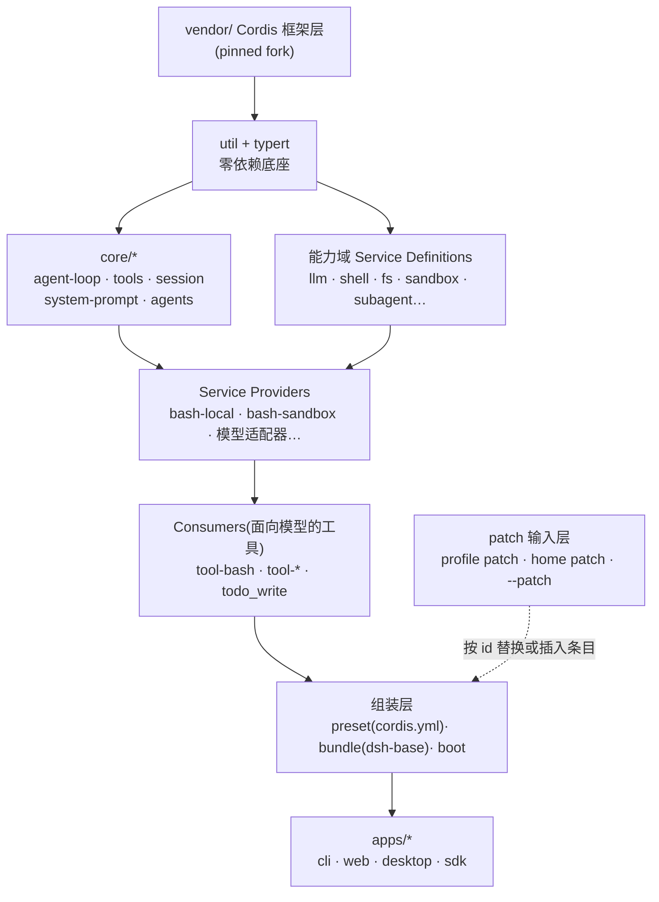

# 笔记 01|仓库地图与包依赖

> 基于 commit `c291e7961a515f6d7af9304e7fd1d257929aef26`(2026-09-10,release-0.1.5-rc.2 分支合并),版本 `0.1.5-rc.2`,克隆自 `github.com/deepseek-ai/deepseek-harness`。
> 本文是系列笔记的地图页:先建立仓库的整体形状,后续每篇笔记再深入一个机制。

## 一、机制作用:这个仓库在造什么

deepseek-harness(dsh)是一个 **Agent Harness(智能体执行运行时)**:介于大模型 API 与最终应用之间,负责会话循环、工具执行、权限与沙箱、上下文组装。官方架构文档(`docs/architecture.zh.md`)的一句话定位:

> 产品的每一部分都是插件,包括模型适配器、工具注册表、会话日志,以及 agent loop(智能体循环)本身,因此每个都可以从配置替换。

## 二、顶层布局(读码实测)

```text
deepseek-harness/                     (工作区版本 0.1.5-rc.2,pnpm@11.7.0,Node ^22.19 || >=24)
├── packages/        268 个 npm 包,按 50 个能力域分组(packages/*/*)
├── apps/            产品组装层:cli(own `dsh` bin)/ desktop / desktop-host / web
├── vendor/          vendored Cordis 框架全家桶(见笔记 02)
├── native/          Landlock launcher(native/system)——Linux 内核级进程限制
├── python/          Python SDK 运行时(sdk-runtime 是一个 workspace 包,随单 exe 分发)
├── docs/            架构文档 + 生成的模块依赖图(module-graph.zh.md,1458 行,CI 新鲜度门禁)
├── benchmarks/      仓库级基准依赖
├── website/         文档站
├── scripts/         工程脚本(含 README 契约校验、入口点校验等 CI 门禁)
├── patches/ patches 目录、snapshots/(vitest 快照)、SECURITY 等顶层文档
```

工具链事实(来自根 `package.json`):TypeScript + tsdown 构建(双 ESM/CJS)、vitest 测试(含 e2e/基准/覆盖率分区)、oxlint、jscpd 查重;`pnpm-workspace.yaml#linkWorkspacePackages: true` 让 vendor 内的保留语义化版本范围解析到本地 pinned 源码。

## 三、能力域地图:50 个组怎么读

官方权威映射是 `packages/README.zh.md` 的分组表(每个包只属于一个组,作用域 `@deepseek-ai/dsh-*`)。268 个包直接罗列没有意义,下面按**能力家族**重新组织——括号内是该域的实测包数。

> **先分清两个词**:**能力域**(package group)指 `packages/` 下这 50 个物理分组,是仓库组织单位;**能力 seam**(capability seam)指笔记 02 将展开的三角色设计模式(Service Definition/Provider/Consumer)。一个能力域可以装下一个完整 seam(如 `shell/`),也可以只承载 seam 的一个角色或纯粹的非 seam 基础设施(如 `util/`)。

### 1. 智能体内核(循环从哪来)

| 域 | 包数 | 职责 | ctx 键 |
|---|---|---|---|
| `core/` | 8 | 产品 API 主干:`agent`、`agent-loop`、`agent-default-model`、`agent-tool-presentation`、`session`、`system-prompt`、`tools`、`scope` | `ctx.agents` / `ctx.agentLoop` / `ctx.tools` / `ctx.systemPrompt` / `ctx.sessions` |
| `llm/` | 7 | 消息与流式词汇表 + 适配器 seam + 各模型提供方 | `ctx.llm` |
| `guard/` | 2 | 循环卫生:重复调用提醒、`tools/execute` 截止时间强制 | — |
| `interaction/` | 5 | 人机协作平面:批准/交互 seam、权限预设、询问用户的工具 | — |

### 2. 执行世界(模型的手脚)

| 域 | 包数 | 职责 |
|---|---|---|
| `shell/` | 10 | **规范 seam 范例**:`shell`(SD)/ `bash-local`、`bash-sandbox`、`pwsh-local`、`pwsh-sandbox`、`shell-env`(Providers)/ `tool-bash`、`tool-bash-persistent`、`tool-pwsh`、`tool-pwsh-persistent`(Consumers) |
| `terminal/` | 3 | 持久 PTY:所有者范围的会话 + 面向模型的工具 |
| `subprocess/` | 3 | 子进程 seam:Service Definition + 本地进程树提供方 |
| `sandbox/` | 4 | 进程限制 seam:**bwrap、Landlock、Seatbelt** 三后端 |
| `code-runtime/` | 2 | 代码执行:Service Definition + worker 线程提供方 |
| `e2b/` | 3 | E2B 远程运行时(POC) |
| `fs/` | 8 | 文件系统 seam:本地实现、面向模型的文件工具、发现工具 |
| `lsp/` | 3 | LSP seam:stdio 提供方 + `lsp` 工具 |
| `web/` | 6 | Web seam:搜索/获取提供方 + 面向模型的 Web 工具 |

### 3. 上下文与记忆(六个子方向之一)

| 域 | 包数 | 职责 |
|---|---|---|
| `session/` | 19 | 持久会话数据平面:持久化 seam + 后端、投影 seam、基于日志的标题 |
| `session-query/` | 4 | 会话检索:逻辑语料库、有界读取、血缘、语义过滤、SQLite 全文搜索 |
| `compaction/` | 4 | 压缩:Service Definition + 基础提供方 + 命令 Consumer |
| `context/` | 6 | 模型可见请求上下文:workspace 指令、时间上下文、引用 |
| `spill/` | 3 | **工具结果 spill**:存储 seam + 本地实现 + 策略(大结果落盘截断) |
| `storage/` | 4 | 非会话存储中枢 + 后端 + 领域形式 |
| `attachment/` | 2 | 持久附件:内容寻址存储 |

### 4. 任务与工作流

| 域 | 包数 | 职责 |
|---|---|---|
| `goal/` | 4 | 同会话 goal 持久化与生命周期 |
| `plan/` | 1 | Plan 协作状态(直接进入命令 + 经评审的退出) |
| `todo/` | 1 | 面向模型的 `todo_write` 工具 |
| `schedule/` | 1 | 会话内定时后续操作 |
| `jobs/` | 3 | 通用后台任务运行时 + 作业控制工具 |
| `workflow/` | 4 | 工作流 seam、worker 线程引擎、`workflow`/`ralph` 工具 |

### 5. 多智能体

| 域 | 包数 | 职责 |
|---|---|---|
| `subagent/` | 10 | subagent seam:提供方注册表约定 + 面向模型的委托工具 |
| `experimental/` | 9 | 私有原型;含 **Agent Teams**(持久 roster、任务板、mailbox 的协作 seam) |

### 6. 组装与扩展(笔记 02 的主角)

| 域 | 包数 | 职责 |
|---|---|---|
| `preset/` | 2 | 由 preset `cordis.yml` **按会话组装 agent** |
| `bundle/` | 6 | 可安装的 `dsh --profile` 补丁层(`dsh-base` 是共享第一层) |
| `boot/` | 2 | app bin 启动粘合层(profile 叠加、patch 实时重载) |
| `extensions/` | 4 | agent 运行时**自修改**:模型可写插件的实时挂载/卸载 |
| `hooks/` | 3 | 钩子桥接 + Claude Code/Codex 线协议库 |
| `skill/` | 4 | skill 提供方注册表、本地提供方、目录/loader 工具 |
| `mcp/` | 1 | MCP 接入 |

### 7. 前端与对外接口

| 域 | 包数 | 职责 |
|---|---|---|
| `client/` | 51 | web GUI 浏览器半侧:shell、协议层、slot、`ui-*` 插件(**全仓最大域**) |
| `host/` | 8 | web GUI 宿主半侧:API 网关 + HTTP 路由 |
| `web/` | 6 | (属 web 能力系列,见上) |
| `webhook/` | 2 | 已验证外部事件 → Workspace 会话 |
| `sdk/` | 3 | 进程外 SDK:JSON-RPC 协议 + 客户端/服务器 |
| `acp/` | 1 | ACP(Agent Client Protocol)服务器 |

### 8. 基础设施

`util/`(15,零依赖工具)、`typert/`(4,类型图生成与运行时注册表)、`settings/`(2)、`credentials/`(3)、`identity/`(1)、`feedback/`(2)、`api/`(6)、`workspace/`(1)、`test-support/`(7,不发布)、`runtime-diagnostics/`(1)。

## 四、分层与依赖规律

官方规则(`packages/README.zh.md` §依赖 + 能力 seam 笔记):

1. **依赖图由工具生成**:`docs/module-graph.zh.md`(`pnpm run gen-module-graph`),CI 有新鲜度门禁——依赖关系不是文档,是受版本控制的可校验产物。
2. **扩展插件依赖 Service Definition,绝不依赖具体提供方**。`dsh-agent-loop` 本身可替换;UI、钩子和工具插件使用 `dsh-agent`。
3. 分层方向(实测归纳):`vendor/`(框架层)→ `util/`+`typert/`(零依赖底座)→ `core/*`+各能力域 SD → Providers → Consumers/工具 → `preset`+`bundle`+`boot`(组装层)→ `apps/*`(产品层)。



## 五、读码才知(文档未直说或需拼装才知道)

1. **框架层是被 fork 后 vendor 进来的,且动过内核代码。** `vendor/README.md` 的本地修改清单第 6 条:对 `cordis/src/fiber.ts` 做了"生命周期加固"——关闭了三个**可重入销毁缺口**(effect 的 owner 列表包装先于 setup 注册、同步 setup 失败回滚清理、UNLOADING 期间拒绝新建 effect)。这不是纯引用,而是上游分叉维护,说明 dsh 对 teardown 确定性有产品级要求。
2. **沙箱下沉到了内核原语。** `sandbox/` 域的后端是 bwrap(bubblewrap)、**Landlock**(Linux LSM)、Seatbelt(macOS sandbox-exec)——`native/system` 是专门的 Landlock launcher native 包,并计入 pnpm workspace。这解释了"权限管线"为什么在 Windows 之外能做内核级强制。
3. **Python SDK 不是重写,是分发。** `python/sdk-runtime` 是 workspace 里的"纯依赖清单包",单 exe 构建把 `dsh` CLI 打成 wheel,客户端以 `dsh --profile sdk` 启动——TypeScript 运行时仍是唯一实现。
4. **README 是受 CI 强制的契约。** `scripts/verify-package-readme-*.ts` 校验每个包 README 必须含"模型体验"与"Known Limitations and Deferred Work"(有允许清单)——文档缺失会挂 CI,这是每个包 README 都含这两节的机制原因。
5. **最大的域不是内核而是前端**:`client/` 51 个包(web GUI 浏览器半侧),接近全仓的五分之一——harness 的产品重心同样在交互层。

## 六、术语对照表(系列通用,后续笔记链接回此)

| 术语 | 是什么 | 见 |
|---|---|---|
| 能力域(package group) | `packages/` 下 50 个物理分组,仓库组织单位 | 本篇 |
| 能力 seam(capability seam) | 可替换能力的设计模式:三角色整体,不是接口 | 笔记 02 |
| Service Definition(SD) | 拥有 `ctx.<key>` 的 Cordis `Service`(抽象类或注册表服务),只含约定词汇 | 笔记 02 |
| Service Provider | 实现 SD 的插件(本地/沙箱/远程是兄弟包) | 笔记 02 |
| Consumer | 模型与插件编程所面向的内容(常为面向模型的工具),只注入服务键 | 笔记 02 |
| fiber | Cordis 中一个插件实例的生命周期载体(状态机) | 笔记 03 |
| realm | Cordis 的隔离领域:同一服务键可在不同 realm 各有一份实现 | 笔记 03 |
| scope | dsh-scope 提供的 agent 级注册世界(可见性 + 生命周期) | 笔记 03 |

## 七、与 Deep Agents 对比(初步)

Deep Agents 是单仓库单包(`langchain-ai/deepagents`,Python),所有中间件在一个包里;能力边界靠"中间件栈"的函数式组合表达,替换能力=换一个中间件实例。dsh 则把同样的理念**物理化**为 268 个包:能力边界=包边界,替换能力=换一个 Service Provider 插件,且由 Cordis 的依赖等待机制在运行时自动接线。两者是同一设计哲学(一切可替换)的两种工程化尺度——这组对比会贯穿后续笔记,本篇只需记住:**dsh 的复杂度大部分花在"让替换成为一等公民"上**。

---
*校验命令:`find packages -maxdepth 2 -mindepth 2 -type d | wc -l` → 268;包数分布见正文各表。所有行号引用基于 commit c291e79。*
