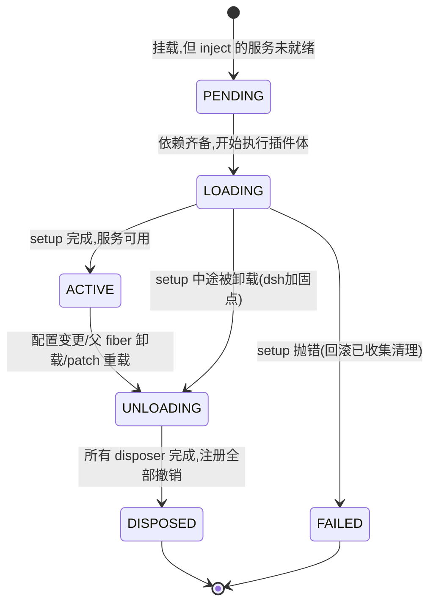

# 笔记 03|插件生命周期与装配管线(boot/profile/preset/scope)

> 基于 commit `c291e7961a515f6d7af9304e7fd1d257929aef26`。核心材料:`vendor/cordis/src/fiber.ts`、`packages/boot/app-boot/README.zh.md`、`packages/preset/README.zh.md`、`packages/core/scope/README.zh.md`、`docs/architecture.zh.md` §Profile 与组合包。
> 前情:笔记 02 讲了"服务如何被声明与注入";本篇讲**插件从声明到运行到卸载的一生**,以及 dsh 如何用 profile/patch/preset 把 268 个包装配成不同的产品。

## 一、机制作用:一条流水线,四层配置

dsh 里"插件生命周期"发生在两个时间尺度上:

- **进程尺度**:`dsh --profile web` 启动时,boot 管线把环境层 → 组合包栈 → patch 层依次折入一棵 Cordis 配置树,交给 Loader 挂载;此后 patch 文件的合法编辑可**不重启**重组(live reload)。
- **会话尺度**:每个 agent 可以在自己的 `agent.ctx` 上挂只属于自己的工具/提示词/技能(preset + scope)——**一个进程同时跑多个组装方式不同的 agent**。

## 二、Fiber 状态机:Cordis 的插件生命周期

每个插件实例对应一个 **Fiber**(`fiber.ts:184`),状态机(`fiber.ts:147`):



> 图注:FAILED 由 `_error` 推导(`:575-578`),可从任意活动态进入,不止 LOADING——排查时以 `_error` 为准。

实测代码证据:

- `fiber.ts:194` `public state = FiberState.PENDING`——**初生即 PENDING**,"等依赖"是默认态;
- `fiber.ts:323` `this.state = FiberState.ACTIVE`——注意这是**根 fiber(uid=0)的构造路径**;一般 fiber 转 ACTIVE 走 `:581-583` 的 `_updateState → _getState` 推导刷新;
- `fiber.ts:575-578` 状态推导:`uid===null → DISPOSED;_error → FAILED;epoch≠INACTIVE → ACTIVE;否则 PENDING`;
- `fiber.ts:420` UNLOADING 态拦截(配合 vendor 加固:UNLOADING 中**拒绝新建 effect**,防止清理期间注册逃逸)。

**dsh 加固的含义**(vendor/README 本地修改第 6 条):effect 的 owner 列表包装先于 setup 主体注册——setup 跑到一半被卸载时,清理仍能收齐;同步 setup 失败会移除包装并回滚。这是"可逆副作用"承诺的底层保障。

## 三、启动管线:boot() 里发生什么

`packages/boot/app-boot` 是所有 `dsh` 应用的共享启动库。最小入口(app-boot README):

```text
installFailLoud('dsh')
const ctx = await boot('dsh', resolveConfigPath(argv[2], process.env.DSH_SNAPSHOT))
```

### 3.1 配置叠层顺序(谁覆盖谁)

```text
空条目列表
  └─ 1. profile 按序叠放组合包(bundle 栈;dsh-base 是共享第一层)
  └─ 2. profile 自己的 cordis.patch.yml
  └─ 3. home 级 cordis.patch.yml        ← 用户 tweak,优先级更高
  └─ 4. --patch overlay                  ← 命令行临时层
每条 patch:按 id 定位条目,替换其整个 config,或插入新条目(支持 !!js 插值)
```

环境层独立于 patch:`.env` 的优先序是 **继承环境 > 调用目录文件 > harness home 文件**——调用目录的文件优先于 harness home 的文件,两者都低于继承环境;文件里设置进程启动变量(`PATH`、`DSH_*`)会被**拒绝**,四个代理变量(`HTTP_PROXY` 等)**只认 harness home 的文件**——防止 clone 里夹带的 `.env` 劫持启动行为。

### 3.2 失败哲学:fail loud

- 失败 = 一行带标签的信息 + 非零退出码,**绝不静默卡死或裸堆栈**;
- 两阶段标签:`host preparation failed`(`prepare` 在挂载任何条目前抛)vs `plugin tree failed to load`(其后一切);附加最深层的原始插件错误;
- 上报错误前先拆卸整个应用上下文——**不留半启动残留**;持有终端的应用退出前恢复终端(有界,卡住的清理只会延迟退出)。
- `assertEntriesActivated` 单一 rejection 检查点:未启动的条目会连同它等待的服务一起报告(把笔记 02 的"PENDING 等待"在启动末期显式审计)。

### 3.3 live reload:热重载是生命周期的一等公民

`patchReload: live` 的 profile(web 模板)**监视两份用户 patch 文件**:合法编辑无需重启即可重组插件树;**被拒绝的编辑让最后一个可用应用继续运行**(事务性回滚,由 vendor 加固后的 Loader/Include 事务机制支撑,vendor/README 第 8 条)。`headless/sdk/acp` 模板只做 startup 一次性应用——因为一次性/stdio 应用的生命周期不支持半途换依赖。

配置预览:`dsh --profile web --dump-config` 打印按源文件与 patch 层分组、可加载的 YAML——**机器上实际生效的配置树可完整导出**。另有回放模式:启动 `cordis.snapshot.yml` 替代文件,让已记录会话原样复现。

## 四、会话尺度:preset 与 scope

### 4.1 preset:按会话组装 agent

`packages/preset`:agent preset = 一个目录,内含 `agent.cordis.yml`。从 preset 组装的会话用该 preset 的工具/提示词段落/技能,**其他会话不受影响**;`persona` 包提供可组装的人设行,遮蔽或替换部署级人设。`ctx.agentPresets` 拥有名单与"仅通过复制创建 preset"的防护。架构文档规则:让某会话拥有不同能力集合 → 组装 preset,**其中的服务行需要 `isolate` realm**(隔离领域——同一服务键在不同 realm 各有一份实现)。这不是空话,仓库自带的 `minimal` preset 是真实样例(`packages/preset/agent-presets/presets/minimal/agent.cordis.yml:21-27`):

```yaml
- id: persistent-shell
  name: cordis:group      # group 行:provider+consumer 打包进同一 realm
  group: true
  isolate:
    terminals: true       # 条目本地 realm:本 preset 一份 ctx.terminals
  config:
    - id: pty
      name: '@deepseek-ai/dsh-terminal'              # provider
    # ...(此后是 persistent-bash 等 consumer 行)
```

反面规则写在 `standard` preset 的注释里(同目录 `agent.cordis.yml:11-12`):服务行**必须**放在携带 `isolate` realm 的 group 内,否则发布进根 realm、成为进程级全局,第二个发布同名服务的 preset 会相撞——`agent-presets` 的挂载审计会直接拒绝这种行。`cordis:include`/`cordis:group` 两个 Loader builtin 由 boot 的 `mountRootInclude` 注册(详见笔记 10)。

### 4.2 scope:agent 级注册世界

`packages/core/scope`(零依赖库)提供原语,core 组所有注册表构建其上:

```text
const scope = createScope(ctx, agent)     // 在 ctx 的 fiber 下创建带标签作用域
scope.ctx.on(...) / scope.ctx 上的注册    // 只对该 agent 可见,且归 scope 所有
await scope.dispose()                     // 撤销该 scope 的每一项注册
```

继承规则(README 明确):**子作用域继承祖先贡献,较近的定义优先;祖先可观察后代活动,两种关系均不反向**。这就是"`agent.ctx` 上注册的工具只对该 agent 可见"的实现底座;跨 agent 的事件路由用 `scopeTarget(base, key)` 载体(无标签监听器保持全局,带标签者收本键及后代事件)。

## 五、设计权衡

1. **配置即插件树的源代码**。dsh 没有"配置文件读进对象"这种传统姿势——profile/patch 组合出的 YAML 就是 Loader 要挂载的插件清单本体。代价:`!!js` 表达式、条目 id、patch 语义都要学;收益:改配置=改运行时(热重载),配置可 dump 可回放。
2. **fail loud 覆盖一切角落**:空 patch 文件都要启动失败(要禁用请写 `[]`)、patch 指定不存在的条目输出警告、缺失组合包明确失败——静态结构错误全部前置到启动,绝不让运行时吞掉。
3. **live reload 只给支持的形态**:web 模板默认 live,一次性运行器强制 startup——**承认有些生命周期的热替换是伪需求**,不追求全产品统一。
4. **隔离的三个层次**:realm(isolate,服务键级隔离)→ scope(注册可见性级隔离)→ subagent(独立上下文级隔离,后续笔记)。从轻到重,避免动辄上子代理。

## 六、与 Deep Agents 对比

deepagents 没有"进程装配"概念:import → 构造 `createDeepAgent({...})` → 运行,配置就是 Python 参数;改配置=改代码+重启。dsh 把装配做成四级动态层(bundle/patch×2/overlay),并支持热重载与会话级组装。对应物上:deepagents 的 `Subagents` 参数 ≈ dsh preset(但只作用于单 agent,无名单/发现/人设行);LangGraph 的 checkpointer ≈ dsh 会话快照(但只存对话状态,不存插件树)。**dsh 的装配管线在 deepagents 里完全没有对应物**——这是两个项目最大的形态差异:dsh 是"可运行的产品",deepagents 是"可导入的库"。

## 七、读码才知清单

1. `.env` 对代理变量的歧视性处理(只认 harness home,不认 clone 目录)写在 app-boot README 里,属于"防供应链意外"的防御设计——不改代码很难想到配置层还管这个。
2. 空 patch 文件**启动失败**、`[]` 才是禁用——把"忘写内容"与"故意清空"区分开,语义精确到令人发指。
3. fiber 的 `state` 是真实的存储字段(`:194`),但真值由 `_getState()` 从 uid/_error/epoch **推导刷新**(`:575-578`)——其中 `FAILED` 的判定优先于 `ACTIVE`(有 `_error` 就算失败,哪怕 epoch 还在)——排查插件为何没起来时,先看 `_error`。
4. preset 创建只能**通过复制**(`agent-presets` 的防护规则)——防止两个会话共享同一 preset 目录产生跨会话副作用,preset 天然是快照语义。
5. 启动失败时未启动条目会**连同它等待的服务**一起报告——Cordis 的 PENDING 机制不仅不报错,还在最后把"你在等谁"说清楚,fail loud 与依赖等待是配套设计。

---
*校验命令:`grep -n "patchReload" packages/boot/app-boot/src/profile.ts`(预期 :55/:86/:108);`sed -n '21,27p' packages/preset/agent-presets/presets/minimal/agent.cordis.yml`。所有行号引用基于 commit c291e79。*

*下一篇(04)进入数据平面:事件溯源会话——`ctx.sessions` 的 append-only 日志、v0/v1 格式迁移、投影 seam 与"模型可见即已记录"不变式。*
