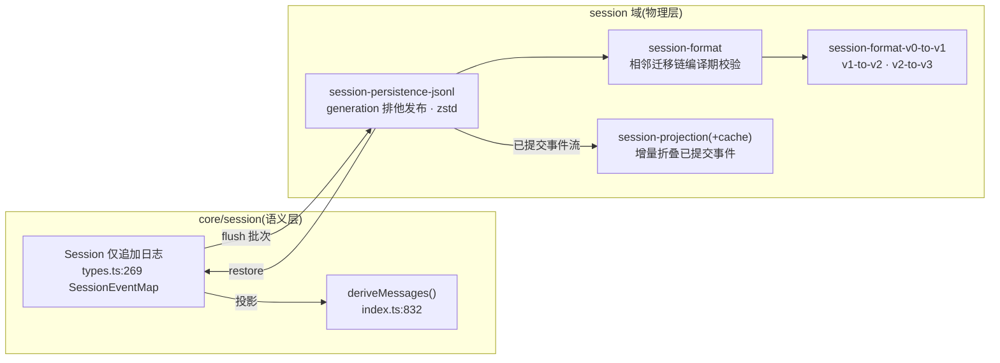

# 笔记 04|事件溯源会话(Session Event Log)

> 基于 commit `c291e7961a515f6d7af9304e7fd1d257929aef26`。核心材料:`docs/subsystems/session.zh.md`(1187 行,权威子系统文档)、`packages/core/session/src/`(types.ts / surface.ts / index.ts)、`packages/session/` 域 19 包。术语表见笔记 01 §六。

## 一、机制作用:整台机器只有一份账本

会话子系统是 dsh 的数据平面。一句话定位(`docs/subsystems/session.zh.md` 开篇):

> `Session` 是一份由类型化 `SessionEvent` 组成的**仅追加日志**,是 agent 完整交互历史的唯一真源。LLM 消息历史从日志*派生*而来,从不单独存储;回放即从同一组事件重新派生。

这就是**事件溯源(Event Sourcing)** 在 agent 运行时上的完整落地:不存"当前对话消息列表",只存"发生过什么事件";模型每次看到的历史都是**投影**,不是存储状态。它直接支撑架构文档的核心不变式——**模型可见即已记录**:抵达模型请求的一切必须能从日志重建,并由运行时不变量断言(`docs/architecture.zh.md` §会话日志)。对照笔记 03:配置树是"控制平面"的账本,这里就是"数据平面"的账本。

## 二、代码走读

### 2.1 事件词汇:`SessionEventMap`(`packages/core/session/src/types.ts:269`)

merge-extensible 的仅追加事件类型表,核心成员:`turn/start{turn}`、`turn/end{reason}`、`step/*`、`system/message`、`user/message`、`assistant/message`、`assistant/attempt`、`tool/call`、`tool/result`。插件经声明合并扩展自己的事件——压缩 seam 添加 `compaction/start` / `compaction/summary` / `compaction/end`,钩子桥接添加 `hook/invoked` / `hook/result`(仅日志记录)。所有成员列在生成的[持久化日志事件目录](persistence-catalog)。

两个关键结构事实:

- **`seq` 是带品牌 branded 的单调位置**(`SessionSeq = BrandedNumber<'SessionSeq'>`,`seq = log.length`),整个日志无空洞;算术结果必须重新过构造器接纳——编译期就把"序列号算术"这种错挡住。
- **`ignorable` 标记的默认拒绝语义**(`types.ts:483`):读者遇到不认识的类型时,带 `ignorable: true` 可跳过;**没有标记必须拒绝重建整个会话**,因为一个未知必需事件可能改变日志其余部分的解释方式。writer 只在"丢失也不影响重建"的纯信息事件上标 true——忘标导致的是 over-refuse(不方便),而不是静默吞掉关键事件。这是把"向前兼容"从惯例变成类型系统约束的典型设计。

### 2.2 Surface:哪些事件"产生消息"(`types.ts:412`)

只有四种 **`SurfaceEventType`**(`system/message` / `user/message` / `assistant/message` / `tool/result`)携带 surface 元数据(`surfaceOp`、`sourceEventSeqs`),参与有序派生 surface;其余事件(boundary/attempt/error)是结构信息,**编译器强制**它们不得携带 surface 字段。特别地:

- `system/message` 承载渲染后的系统提示词:第一条是 surface 第 0 号节点,提示词变化时**恰好替换**最新系统节点(surface 折叠拒绝任何其他对第 0 号节点的覆盖);后续系统节点是普通历史,压缩替换可以遮蔽它们(设计笔记:`.agents/notes/.../2026-06-18-session-surface.zh.md`)——这就是笔记 08 compaction 能"换掉系统提示"的机制入口。
- `assistant/message` **嵌入产生它的完整紧凑带时间 stream**——持久化层存的是每次 attempt 的一个 durable settlement,stream 是回放、usage 统计与 UI 证据,不投影为第二条 message。

### 2.3 派生历史:`deriveMessages()`(`packages/core/session/src/index.ts:832`)

日志 → `Message[]` 的投影函数,两个属性:**缓存**(每个 surface 节点首次出现时投影一次,重写触发重建)与**冻结**(返回新数组、共享深冻结消息——"通过投影修改已记录的历史"在类型上不可表达)。投影规则:

| 日志事件 | 投影结果 |
|---|---|
| `user/message`(真用户) | 一条 user 消息,content 原样 |
| `user/message`(注入上下文,非 user 来源) | 按时间序的 user-role 消息,类型化 source 标明生产方 |
| `assistant/message` | 一条 assistant 消息(携带提供方/模型);**空内容的跳过**——max-tokens 截断的空步骤仍记录事件保存 stream/usage,但不进 transcript |
| `tool/result` | 一条带 `tool-result` 块的 user 消息 |
| 其余(`turn/*`、`step/*`、`assistant/attempt`、`llm/retry`) | 结构信息,不投影 |

token 记账展开每个嵌入 stream;失败的 attempt 借此保留提供方 usage 而无需虚构 assistant 消息。

### 2.4 fork:两种委派,两种截断策略

底层原语 `ctx.sessions.create(id, { seed, meta })`;策略 API `fork(source, boundary?, childSessionId?)`:选取到 boundary 的前缀,**拒绝结束于开放轮次内的前缀**(显式报错而非静默截断)。但 `dsh-subagent-fork-in-process` 保留"已完成前缀截断"逻辑——因为**工具调用时的子代理委派通常发生在父轮次仍然打开时**。同一个"fork 想要什么"的问题给出两个答案:会话分支要可审计的稳定边界,子代理委派要低延迟的即时截断。

### 2.5 `session/end-seed`:一条为什么必须存在的边界事件

种子历史与实时工作**字节级完全相同**,这让拥有独立开/闭括号语义的插件失效:一条未配对的 `compaction/start`,无论来自"压缩中途崩溃"还是"正在压缩",读起来完全一样。解法:fork 构造时在精确持久 cut 处追加 `session/end-seed { inherited: true }`——**marker 之前的开启括号属于已结束的生命周期**,其所有方可视之为已死。注意边界的**所有权归属**:核心只写不读;崩溃修复只关闭轮次/步骤/工具边界,**从不处理 `compaction/*`**——括号词汇仍归声明它的插件。

### 2.6 轮次封闭与不变量

轮次包围的是**一次模型循环执行**,不是整个会话日志:插件的纯日志事件可以落在 `turn/end` 与下一个 `turn/start` 之间(占 seq 不占轮次号);需要即时持久屏障的生产方显式等待 `ctx.sessions.flush(session)`。可选的 `dsh-session/invariant` 配套插件强制核心关系:轮次/步骤编号、执行封闭、同一步骤内工具调用/结果配对——**可合并扩展事件的关系由声明它的插件拥有**,核心不会因没有开放轮次拒绝未知事件。

### 2.7 结束原因:`TurnEndReasonMap`

`completed` / `aborted` / `blocked` / `error{LlmFailure}` / `max-tokens` / `interrupted`,merge-extensible。两条精确规则:**只要轮次内任何步骤触顶,整轮就以 `max-tokens` 结束**(即使之后插件继续执行——截断事实优先);**`interrupted` 是唯一不由任何 loop 实时发出的原因**——它由崩溃恢复事后合成,事件流本身保持原样。

## 三、持久化格式与版本链(与 session 域 19 包)

会话域(`packages/session/`,19 包)把"日志语义"与"物理存储"分开:

- **文件命名**:`session.jsonl`(generation 0)/ `session.v{N}.jsonl`(`session-format/src/filename.ts:16`),可加 `.zstd`;**已提交 generation 路径绝不重命名、替换或删除**,写侧经排他发布(`session-persistence-jsonl/src/lease.ts`)旁挂后继文件。
- **迁移是纯函数相邻步**:每个迁移包只负责一个 `vN → vN+1`;打开会话时"只 Decode 并组合一次构建时静态确定的相邻迁移链"(`docs/architecture.zh.md`),`catalog.ts` 在构造期校验 codec 无重复、无缺号——**迁移图是编译期产物,不是运行时发现**。
- **只读快路径**:仅 header 的 `stat`/`list` 重扫目录选最高规范 generation,不加载事件体。

## 四、设计权衡

1. **派生 vs 存储**:消息历史不存储,每次派生——多花 CPU,换来"改投影规则=改历史观感而不动数据"(transcript、遥测、标题、恢复全部从同一 settlement 派生)、以及不变式可断言("模型可见即已记录"可以写成运行时检查,因为模型可见集就是日志投影)。
2. **必需默认 + ignorable 例外**:未知事件默认拒绝重建。代价是插件作者忘标 `ignorable` 会让新事件在旧读者处"硬失败";收益是永远不会出现"读者默默跳过了一个改变语义的事件"。
3. **核心不认识插件事件**:`session/end-seed` 只写不读、崩溃修复不碰 `compaction/*`、invariant 只查核心关系——**日志的语义所有权逐事件归还声明方**,这是微内核思想在数据平面的复刻。
4. **两种 fork 策略并存**而不是统一成一个:承认"会话分支"与"子代理委派"是不同的操作,各有正确性要求。

## 五、与 Deep Agents 对比

| 维度 | dsh 事件溯源 | Deep Agents / LangGraph |
|---|---|---|
| 真源 | append-only 事件日志,消息是投影 | 每步序列化**状态快照**(channel values 的 checkpoint) |
| 历史重建 | 重新派生,规则统一(`deriveMessages`) | 反序列化 checkpoint,历史即存的 message 列表 |
| 中断恢复 | `interrupted` 事后合成 + 开放轮次修复 + generation 链 | checkpoint 重放到最后一个成功步 |
| 长会话记忆 | 全历史在日志,靠 compaction 调窗口 | Checkpointer(线程内)+ Store(跨线程) |
| 系统提示词 | `system/message` 是 surface 节点,进日志、可替换 | 组装函数每步重算,不进"账本" |
| 扩展事件 | 声明合并 + ignorable + 逐事件所有权 | 中间件自定义 state key |

最实质的差异在最后一行前三行:dsh 把"智能体说过什么、看过什么"做成**不可变事实记录**,LangGraph 做成**可覆盖的状态**。前者贵而可审计(回放/血缘/取证全免费),后者廉而易失(改了状态就没了历史)。值得注意 Deep Agents 的文件系统路线其实是一种"粗粒度事件溯源"——把状态变化外置成文件 diff,但没有事件语义。

## 六、读码才知清单(本篇增量)

1. **格式已到 v3**:session 域同时存在 `session-format-v0-to-v1`、`v1-to-v2`、`v2-to-v3` 三个迁移包,而架构文档只写到"JSONL v0/v1"——文档滞后于代码的实例,以迁移包为准。
2. **`ignorable` 默认拒绝**(`types.ts:483`):兼容性策略写进事件信封本身;忘标 marker 的代价是"旧读者拒绝重建"而非"静默丢事件"——故障模式选了吵闹的那种。
3. **`session/end-seed` 服务的不是 fork 而是"括号配对"**:种子里未配对的 `compaction/start` 与崩溃无法区分,这条边界事件把"构造期历史"与"本会话生命周期"切开——崩溃修复因此敢只关轮次/步骤/工具边界。
4. **空 assistant 消息也要记账**:max-tokens 截断的空步骤仍记录 `assistant/message`(保存 stream/usage/路由),投影时跳过——"账本完整性"与"transcript 观感"是两个需求,分开满足。
5. **`interrupted` 是合成原因**:轮次编号与事件 seq 都不因崩溃撒谎,唯一"补写"的是结束原因本身;`max-tokens` 整轮优先——截断事实不会被后续继续执行洗掉。

---
*校验命令:`grep -n "interface SessionEventMap" packages/core/session/src/types.ts`(预期 :269);`grep -n "deriveMessages(): Message\[\]" packages/core/session/src/index.ts`(预期 :832);`ls packages/session | grep format-v`。所有行号引用基于 commit c291e79。*

*下一篇(05)进入控制平面最热的一条链:工具执行管线——`ctx.tools` 注册表、`tools/pre-execute → execute → post-execute` 瀑布与守卫、审批接缝。*
