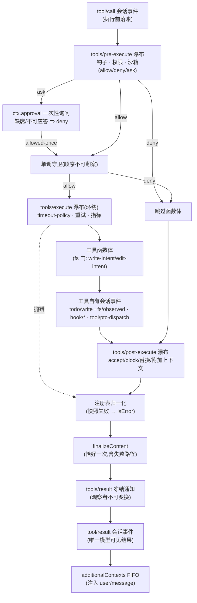

# 笔记 05|工具执行管线(Tools Pipeline)

> 基于 commit `c291e7961a515f6d7af9304e7fd1d257929aef26`。核心材料:`docs/tool-execution-pipeline.zh.md`(官方管线图文档)、`docs/subsystems/tools.zh.md`(720 行权威参考)、`packages/core/tools/src/index.ts`、`packages/guard/README.zh.md`。术语表见笔记 01 §六。

## 一、机制作用:模型的手脚为什么可信

agent loop 决定"调用哪个工具",工具管线决定"这个调用是否被允许、如何执行、结果如何回到模型"。dsh 把这条链做成 **三次瀑布 + 一层单调守卫 + 一条不可变结果通知**,官方图文档的定位:

> 此图展示策略、钩子、沙箱、文件系统守卫、结果重写、最终结果观察和 UI 渲染在**不改变循环**的情况下何时运行。(`docs/tool-execution-pipeline.zh.md`)

"不改变循环"是关键:agent loop(`dsh-agent-loop`,笔记 02)对策略一无所知,所有治理逻辑都以 `tools/*` 事件监听器和守卫的形式挂在 `ctx.tools` 上——这是能力 seam 思想(笔记 02)在安全面的应用:替换策略不必碰循环,替换循环也不必重写策略。

## 二、代码走读:一次调用的完整生命周期

### 2.1 入口:从 ToolExecutionInput 到流水线对象

`ctx.tools.execute()` 接受**调用方拥有**的 `ToolExecutionInput`(必需 readonly `signal`),把解析后的 JSON 参数**一次性物化并冻结**为流水线拥有的 `ToolExecution`,分配注册表所有的 `ToolExecutionToken`(不透明 Symbol,仅供身份关联,调用方无权选择)(`docs/subsystems/tools.zh.md:310`)。随后依次经过:

```text
tools/pre-execute 瀑布(allow/deny/ask,可重排)
  → 已注册的单调守卫(monotonic guards)
  → tools/execute 瀑布(环绕分派:超时/重试/指标;唯一可替换 signal 的视图)
  → 工具函数体 execute(args, exec)
  → tools/post-execute 瀑布(accept/block/replace/加上下文)
  → 注册表外层归一化(快照抛错 → isError)
  → ToolDefinition.finalizeContent(恰好一次,最后的内容不变式)
  → tools/result 同步通知(冻结的权威结果,观察者不可变换)
  → tool/result 会话事件(唯一的模型可见结果)
```

(`docs/subsystems/tools.zh.md:172`;事件签名见 `packages/core/tools/src/index.ts:144/155/167`。)

三个安全语义值得单独记:

1. **先记录,后执行**:`tool/call` 会话事件在执行**之前**落账(`docs/tool-execution-pipeline.zh.md:13`)——结合笔记 04 的"模型可见即已记录",审计账本先于任何副作用存在。
2. **fail-closed 的审批**:pre-execute 的 `ask` 决策交给 `ctx.approval` 一次性询问,**审批服务缺席或不可应答一律按 deny 处理**;被拒的调用跳过函数体但仍走 post-execute(留下被拒记录)。
3. **守卫单调性**:`ToolGuard` 的返回类型**有意不含 allow**——返回 reason 即拒绝,返回 `undefined` 保留瀑布决策;**监听器顺序无法把拒绝翻回允许**(`docs/subsystems/tools.zh.md:317`)。注册入口 `ctx.tools.guard()`(`:516`):普通上下文注册=全局,经 `agent.ctx` 注册=仅该 agent(笔记 03 的 scope 落到此处)。

### 2.2 决策类型:类型化的 Decision 惯例

三个拦截点都返回类型化 Decision(与 `agent/*` 瀑布共享同一惯用模式,`tools.zh.md:376`):

| 瀑布 | 监听器签名 | 决策 |
|---|---|---|
| `tools/pre-execute` | `(exec, next)` | allow / deny / ask |
| `tools/execute` | `(exec, next)`(环绕) | 返回 `ToolExecutionResult`(可包装) |
| `tools/post-execute` | `(exec, result, next)` | accept / block / 替换内容 / 替换值 / 附加上下文 |

后置策略的边界划得很细:**内容替换是展示策略,不是保密策略**——要隐藏程序可见的值必须 block 或替换值;替换内容保留规范值,替换值则重新校验并重算内容/元数据;block 转为带纠正反馈的 `isError`(`tools.zh.md:404`)。未知工具与抛错的工具都归一化为结构化错误(`ToolNotFoundError → UNKNOWN_TOOL`),**调用失败不终止当前轮次**。

### 2.3 结果契约:output 声明 + finalizeContent

`ToolDefinition` 强制携带 `ToolOutputDefinition`(canonical JSON Schema + 纯渲染器 `render`),`execute()` 只返回 canonical 无损 JSON 值;注册表快照、校验、冻结后调用渲染器(`tools.zh.md:372`)。`finalizeContent` 的契约尤其讲究:**注册表在执行开始时快照该回调,对每个归一化结果恰好调用一次——包括绕过 post-execute 的管线失败**(`tools.zh.md:45`),且必须全函数、不得抛错。工具作者因此拥有一个"无论如何都会跑的最后内容不变式"。

### 2.4 调度:parallel / exclusive 与 PTC 模式

每个待定调用带 `ToolExecutionMode`:`parallel` 可与兄弟调用重叠,`exclusive` 独占并形成排序屏障;agent loop 据此形成独占屏障 + 滚动池并行(`tools.zh.md:172` 前后)。**PTC mode**(程序化工具调用)是结构性的执行沙箱:`run_code` 传输的序列化子调用携带 parent token、记录 `tool/ptc-dispatch`;**在 `mode: 'ptc'` 下,只有带 parent 的调用可以执行原生工具名——模型直连调用(无 parent)在策略管线之前就被拒为 `UNKNOWN_TOOL`**(`tools.zh.md` ToolExecutionInput 注释);子调用省略 `additionalContexts` 以保持调用-结果相邻。

### 2.5 guard 组:两个默认启用的循环卫生插件

`packages/guard/` 用两个小插件治两种最常见的循环病(`guard/README.zh.md`):`repeat-tool-reminder`(模型重复完全相同的调用时提醒它换方法或结束任务)与 `timeout-policy`(`ToolDefinition.timeoutMs` 的截止时间强制器——一个 `tools/execute` 环绕包装;`timeoutMs` **绝不发给模型**,`schemas()` 白名单只放 name/description/parameters,声明它等于承诺工具体会协作式响应 `exec.signal`)。两者都在 `dsh-base` 组合包默认启用,可调优或移除。

### 2.6 deferContext 与 concludeTurn:结果附言的受控通道

`ToolRunContext.deferContext(context)` 把附言(嵌套分派上下文、插件铸造的指令)挂到**本次执行自己的结果**上,loop 只在 `tool/result` 之后追加——组合工具转运嵌套上下文、叶子工具铸造指令,都不会在外层调用未结束时泄漏进上下文;`concludeTurn()` 只存在于成功的 `ToolExecutionResult` 上,组合工具必须从嵌套结果**转发**该标记——只有权威的嵌套成功才能结束外层轮次(`docs/subsystems/tools.zh.md` ToolRunContext 注释)。

## 三、管线全景



## 四、设计权衡

1. **三段瀑布 vs 一个中间件栈**:pre(准入)/execute(环绕)/post(检视)把"能否跑""怎么跑""结果如何"三种变化速率分开——超时策略只写 execute 包装,审批只写 pre 监听器,结果脱敏只写 post 监听器,互不纠缠(官方能力 seam 笔记的"按变化速率拆分"在管线上的落实)。
2. **单调守卫 + fail-closed 审批**是安全底座:瀑布可重排(策略可组合),但守卫不可翻案(策略不可互相豁免);审批不可用即拒绝。**便利性与安全性冲突时,syntax 选了后者**。
3. **canonical 值与模型可见内容分离**:`execute` 返回无损 JSON,`render`/`finalizeContent` 决定模型看到什么——"程序取到的值"与"模型可见结果"是两个接口,PTC 的 `tools/ptc-dispatch-log` 只能改持久副本,两者都动不了。
4. **失败不终止轮次**:工具失败=结构化 isError 结果,轮次继续——把错误当成"模型可以利用的信息"而不是"进程事故",这是 agent loop 与传统 RPC 最大的心智差异。

## 五、与 Deep Agents 对比

| 维度 | dsh 工具管线 | Deep Agents |
|---|---|---|
| 审批 | `ctx.approval` 一次性询问,fail-closed,守卫单调不可翻案 | HumanInTheLoopMiddleware:interrupt 中断 + 风险分级审批 |
| 权限规则 | pre-execute 瀑布 + monotonic guard;`restrict()` 按作用域实时过滤 | 文件系统 allow/deny/interrupt 三态规则 |
| 执行隔离 | 进程级沙箱后端(bwrap/Landlock/Seatbelt)+ PTC 结构性限制 | QuickJS 沙箱解释器(code_interpreter) |
| 超时 | `timeoutMs` + guard 域 timeout-policy(协作式 signal) | 无对应公开机制(教程未列) |
| 失败语义 | 归一化 isError,轮次继续;`finalizeContent` 恒跑 | 异常上抛由 LangGraph 图状态处理 |
| 结果附言 | `deferContext`/`additionalContexts` FIFO | 中间件返回值拼装 |

核心差异在**守卫单调性**:deepagents 的中间件是顺序洋葱模型,后注册者理论上能放行前者拦下的调用;dsh 用类型系统把"不能翻案"写死在 `ToolGuard` 签名里——这是把"权限策略不可被顺序意外削弱"作为一等设计目标的证据。

## 六、读码才知清单(本篇增量)

1. **`tool/call` 在执行前落账**(`docs/tool-execution-pipeline.zh.md:13`):意图先于副作用进账本——审计/回放/取证可以覆盖"从未执行成功的调用",这是"先记录后执行"事件溯源纪律在工具面的体现。
2. **守卫签名没有 allow**(`docs/subsystems/tools.zh.md:317`):`undefined` 才是放行——把"顺序敏感的权限"这个常见漏洞类,用返回类型设计消除。
3. **PTC 模式在分派层做结构性沙箱**:无 parent token 的模型直连原生工具调用,在进策略管线**之前**就被拒为 `UNKNOWN_TOOL`——不需要任何策略配置,模型在 PTC 会话里物理上够不到原生工具名。
4. **`timeoutMs` 是承诺而非配置**:声明它等于向注册表承诺工具体会协作响应 `exec.signal`(否则超时无法到达 quiescence);`schemas()` 白名单保证这类调度元数据永不进模型请求(`packages/core/tools/src/index.ts:243`)。
5. **审批服务缺席 = deny**:fail-closed 不是策略选项而是审批接缝的默认值——"没有审批人"被视为"拒绝"而非"放行"。

---
*校验命令:`grep -n "monotonic execution guard" docs/subsystems/tools.zh.md`(预期 :317);`grep -n "logged before execution" docs/tool-execution-pipeline.zh.md`(预期 :13);`grep -n "tools/pre-execute" packages/core/tools/src/index.ts`(预期 :144)。所有行号引用基于 commit c291e79。*

*下一篇(06)讲任务层级:goal / plan / todo 三层任务包与后台 jobs——复杂任务执行子方向的 dsh 答案。*
