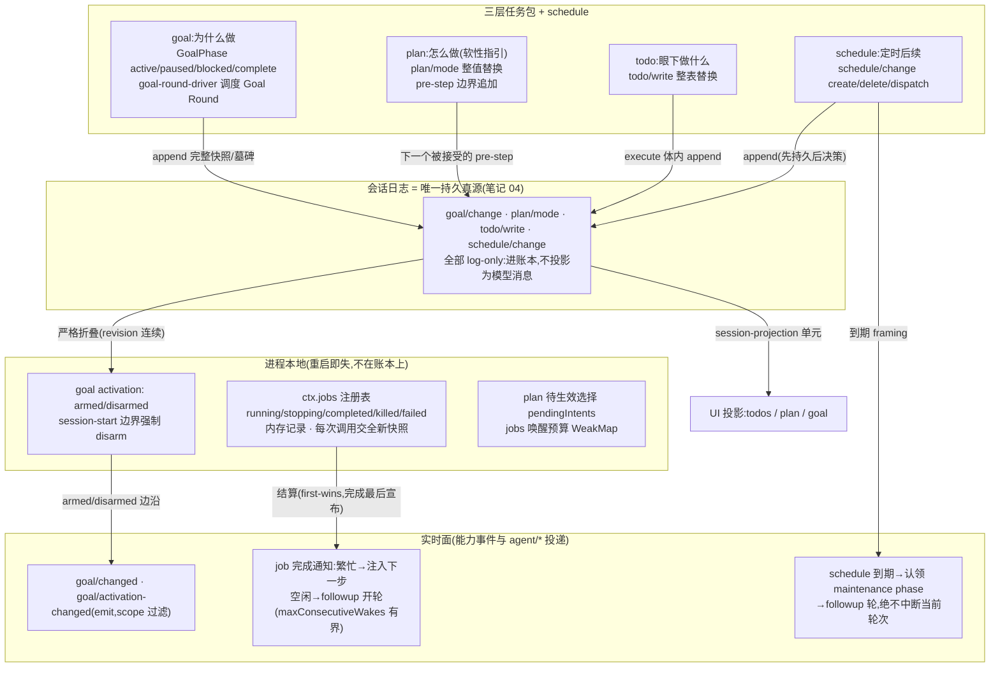

# 笔记 06|任务层级:goal / plan / todo

> 基于 commit `c291e7961a515f6d7af9304e7fd1d257929aef26`。核心材料:`docs/subsystems/goal.zh.md`、`todo.zh.md`、`plan.zh.md`、`jobs.zh.md`、`schedule.zh.md`,`packages/goal|plan|todo|jobs|schedule/` 六个组/包的 README,以及官方设计笔记 `.agents/notes/implemented/feature/2026-07-16-harness-level-loop.zh.md`(Harness 层目标式执行)。术语表见笔记 01 §六。

## 一、机制作用:三层任务包 + 两个伴生运行时

dsh 没有一个叫"任务系统"的统一模块,而是把"复杂任务的执行"拆成**职责正交的三层**,外加两个伴生机制。官方词汇表(`.agents/notes/implemented/feature/2026-07-16-harness-level-loop.zh.md`)给出了确切层级:**Goal → Goal Round → 轮次 → 步骤**——goal Round 是"为当前目标接纳的一次续行周期",轮次/步骤仍归具体 `dsh-agent-loop` 所有:

| 层 | 回答的问题 | 形态 | 持久化 |
|---|---|---|---|
| **goal**(`ctx.goals`) | 为什么做——每会话**一个**长期完成目标 | 服务 + 3 个模型工具 + `/goal` 命令 + 自动续行驱动器 | `goal/change` 会话事件(完整快照/墓碑) |
| **plan**(`ctx.planMode`) | 怎么做——计划模式,先探索设计再执行 | 单包:提示词段落 + `exit_plan_mode` 工具 + `/plan` 命令 | `plan/mode` 会话事件(整值替换) |
| **todo**(`ctx.tools` 注册的 `todo_write`) | 眼下做什么——模型自维护的可见清单 | 只有一个工具包,无服务键 | `todo/write` 会话事件(整表替换) |
| **jobs**(`ctx.jobs`) | 谁替我跑着——通用后台任务运行时 | 抽象 SD + `jobs-local` Provider + `tool-jobs` Consumer | **不进日志**(进程内存) |
| **schedule** | 何时回来——会话内定时后续 | 单包:`schedule_create/list/delete` + live owner 交付 | `schedule/change` 会话事件 |

与笔记 04 的事件三域联动:这四条任务事件(`goal/change`、`plan/mode`、`todo/write`、`schedule/change`)经声明合并加入 `SessionEventMap`,全部标注 **log-only**(`docs/persistence-catalog.zh.md:458/581/658/918`)——只进账本,**不投影为模型消息**;模型看到的是工具结果、`<goal_round>` 提示词这类"消费了状态的渲染物"。而 `goal/changed`、`goal/activation-changed` 是能力实时事件(emit),`agent/pre-step`、`agent/session-start`、`agent/inbox/claimed` 是 agent/* 实时事件——**持久事实在日志,实时通知走事件**。

还有一个贯穿性的权限设计:goal 的 create/edit/pause/resume 要求**人类直接请求的宿主证明**——`Agent.followup()` 与 `steer()` 在调用方省略 source 时分配 `{ kind: 'user' }`,插件与其他非人类生产方必须传入自己的 source,不能冒领人类权限(`packages/goal/tool-goal/README.zh.md` 设计节)。

## 二、代码走读

### 2.1 goal:持久 phase 与进程本地 activation 的刻意分离

goal 领域有两套互不混淆的状态。**持久 phase** 四态(`packages/goal/goal/src/types.ts:45`):

```typescript
export type GoalPhase =
  | 'active'
  | 'paused'
  | 'blocked'
  | 'complete'
```

blocked 是唯一表示"因问题而停止"的持久态,携带策略自有 kebab-case `code` + 自由文本 `message`(`GoalBlockReason`)——预算耗尽、provider 限流、请求人工输入共用这一个 phase,而不是扩增生命周期状态。变更走 compare-and-set:`GoalRef { id, revision }`(`types.ts:20`),每次获准的持久变更递增 revision(`GoalSnapshot`,`types.ts:60`)。落账本在 `GoalService.commit`(`packages/goal/goal/src/index.ts:613`):

```typescript
const event = agent.session.append('goal/change', change)
```

`goal/change` 的 SessionEventMap 声明在 `packages/goal/goal/src/domain.ts:66`,提交后 emit `goal/changed`(`index.ts:625`,scope 过滤,监听器失败被隔离)。

第二套状态是 **activation(`armed`/`disarmed`)——绝不持久化**,且任何 `agent/session-start` 边界都会强制停用续行(`index.ts:255-256`):

```typescript
ctx.on('agent/session-start', ({ agent }) => {
  this.setActivation(agent.session, 'disarmed')
```

含义:**重启、fork、重新打开会话,active goal 都不会自己续跑**,直到有人显式 resume。这是"持久化 ≠ 授权"的边界。回放侧同样严格:fold 要求每次变更恰好推进一个 revision(`packages/goal/goal/src/fold.ts:194-195`),非法 phase 转换、Round 缺口都会拒绝。

调度不属于 goal 服务,而属于可选的 `dsh-goal-round-driver`:idle 时**先预留** `round = roundsStarted + 1`(`goal-round-driver/src/index.ts:174`),等待 `ctx.sessions.flush()` 后才排队(`:145`),经 `agent.followup()` 投递保留的 `<goal_round>` 提示词(`:192`;提示词本体 `src/prompt.ts:15`);`agent/pre-step` 监听器(`:361`)在下游接受前拒绝陈旧/竞争预留——被拒绝的预留不消耗 Round 编号。额度耗尽时以稳定代码 `round-limit` 记 blocker(`:168`)。模型侧 `dsh-tool-goal` 是另一半权限面:`blocked` 调用在同一条件持续不足 `blockedAfterConsecutiveRounds`(默认 3,`tool-goal/src/index.ts:32`)个 Round 前被机械拒绝(`:307`);自主 `complete`/`blocked` 成功后延后 `<goal_complete>`/`<goal_blocked>` 结束指令让模型向用户交代(`src/wrapup.ts:20,29`);对持久 paused goal 的 `resume` 以 `GOAL_TOOL_RESUME_PAUSED` 拒绝(`:284`)——pause 的恢复权专属用户命令。

### 2.2 todo:工具自有会话事件的教科书实现

`TodoItem` 刻意最小化——只有 `content` + 三态 `status`,没有 id、优先级、activeForm(`packages/todo/tool-todo/src/types.ts:21`),因为整表替换(last-write-wins)让条目不需要稳定身份。事件经声明合并进日志(`types.ts:31`):

```typescript
'todo/write': { todos: TodoItem[] }
```

追加发生在工具 `execute` 体内(`packages/todo/tool-todo/src/index.ts:210`),恰好实证笔记 05 的结论"工具自有会话事件在 execute 体内产生";非 agent 调用方在 append 之前就被拒绝(`:208`),因为列表属于创建它的那一个 agent 会话——"单一所有者"是代码硬约束而非文档倡议。UI 状态由投影单元派生(`index.ts:130-140`):最新一次 `todo/write` 即当前计划,**下一个 `turn/start` 清空、`turn/end` 保留刚完成的清单**。另一处部署策略与持久数据的分界:`allowParallelInProgress` 是必填配置(无默认值,缺失即加载失败),但持久日志不变式**刻意不**校验 in_progress 计数——一种策略下写入的日志在切换策略后仍可回放。

### 2.3 plan:log-only 事件 + 唯一 pre-step 追加点

`plan/mode { active }` 是仅记日志、整值替换的会话事件(`packages/plan/plan-mode/src/index.ts:47`),最后一条即状态。它的难点是**追加时机**:轮次进行中不能随便往日志里插事件。解法是把追加点收敛到唯一一处——`agent/pre-step` waterfall 监听器(`index.ts:192`),且**先调 `next()`、只在下游接受该步骤后追加**(`:192-206`),追加失败只 warn 不阻塞轮次。`PlanModeController.set()`(`:171` 起)返回四态 `committed | queued | cancelled | noop`:开放轮次内选择进 `pendingIntents` 等待下一个 pre-step;无开放轮次则立即 append(`:429`)并在需要时 `agent.inject()` 叙述通知(`:432`)。`exit_plan_mode` 在计划模式未激活时**仍保持注册**(`EXIT_PLAN_MODE`,`:61`)——进出计划模式只改 `plan:policy` 提示词段落(`:213`),绝不改变请求的工具目录,工具 schema 因此保持稳定。

### 2.4 jobs 与 schedule:不进三层任务的伴生运行时

jobs 是标准能力 seam 三角色:SD 是抽象类 `JobRegistry`(`packages/jobs/jobs/src/index.ts:62`,直接加载会抛错,注释原文 "loading a second throws",`:38`),`LocalJobRegistry` 是进程内 Provider,`tool-jobs` 是 Consumer。词汇:五种 `JobStatus`(`jobs/src/types.ts:17`)、按 kind 扩展的 `JobKindMap`(`:23`,bash/subagent…)、生产方声明 `JobStart`(`:46`)与 `JobHooks`(`:72`,其中 `done` 在**资源释放后**才 resolve)、只读快照 `JobSnapshot`(`:97`)。关键取舍:**任务状态只活在进程内存**——结算快照、监听器通知都不落日志;完成通知经 `tool-jobs` 的 `fitCompletionNotice`(`tool-jobs/src/index.ts:146`)渲染为 `background job <id> (<kind>: <label>) finished [status: ...]`,繁忙 agent 注入下一步,空闲 agent 由 `owner.followup()`(`:295`)开一轮——唤醒预算 `maxConsecutiveWakes` 默认 3(`:51`),领取用户消息(`agent/inbox/claimed`,`:224`)才恢复,因为"被唤醒的轮可能又启动后台任务,其完成又唤醒同一所有者"是条自激链。

schedule 则回到日志:`schedule/change` 是唯一持久权威(`schedule/src/types.ts:219`;record 变体 `:13/:27/:39`),create/delete/dispatch 三种操作;到期工作认领 agent 的 idle maintenance phase,把 `[SCHEDULE REMINDER]` framing(`domain.ts:808`,批次版 `:830`)经 `followup()` 排入普通后续轮次,再追加 dispatch(`runtime.ts:282,289`)。**它绝不 `steer()`,绝不中断运行中的轮次**;交付边界是 `session-local`——cold 会话不工作,提醒保持 overdue,会话之外没有任何通知渠道。

## 三、结构与流程



Goal Round 的一次准入(预留→围栏→接纳→结算):

```mermaid
sequenceDiagram
    participant D as goal-round-driver
    participant A as Agent inbox
    participant M as 模型
    participant LG as 会话日志
    Note over D: agent idle 且 goal 为 active + armed,roundsStarted 低于 maxGoalRounds
    D->>D: 预留 round = roundsStarted + 1(driver index.ts:174)
    D->>LG: 等待 ctx.sessions.flush()(:145)
    D->>A: followup 渲染好的 <goal_round> 提示词(:192, prompt.ts:15)
    A->>LG: user/message(source=goal, round)
    Note over D: agent/pre-step(:361)拒绝陈旧/竞争预留——不消耗编号
    M->>LG: update_goal(complete / blocked + reason)
    LG->>LG: goal/change 事件(commit, index.ts:613)
    Note over D: 额度耗尽 → block(code: round-limit)(:168);teardown fail-closed
```

## 四、设计权衡(官方明确记录的理由)

1. **状态与调度分离,拒绝通用 loop 抽象。** goal 服务"存储 goal 状态但不调度工作,续行权限是进程本地的而非持久状态"(`packages/goal/goal/README.zh.md`);harness-level-loop 笔记明确拒绝"把持久化、评估、预算、调度、交接、后台任务和 UI 组合在一起的推测性通用 loop 服务"——系统里没有 `packages/loop/`、`LoopDriver`、通用 `StopCondition`;同会话 Goal 与全新 agent Ralph 是两个显式策略,不假装一种生命周期适配两者。
2. **plan 是引导而非限制。** `docs/subsystems/plan.zh.md`:"计划模式是**软性指引**,沙箱模式与审批策略分别强制限制;两者都不读写计划状态"。用文本(plan:policy 段落)而非能力过滤来约束,换来"进出计划模式绝不改变工具目录"(exit_plan_mode 恒注册);代价是需要强制限制时必须另行配置沙箱/审批。
3. **todo 整表替换 + 刻意最小条目。** `docs/subsystems/todo.zh.md` 原文:"Deliberately minimal… No id, priority, or activeForm — the list is replaced wholesale on every write (last-write-wins)"。放弃逐项编辑换取"无稳定身份、无合并冲突",并把"允许多个 in_progress"定为部署必填策略而非编码规则——持久不变式刻意不跟随该策略,保证跨策略可回放。
4. **jobs 靠授权而非保密,唤醒有界。** `docs/subsystems/jobs.zh.md`:"Ids are predictable, so authorization — not secrecy — is the boundary";`tool-jobs` README 解释 `maxConsecutiveWakes` 设界理由:"这条链会自激——被唤醒的一轮可能启动某个后台任务,而它的完成又会唤醒同一个所有者"。配套的还有 teardown 结算预先标记 `reported`,不让销毁花掉一次模型请求去宣布无人能读的通知。

## 五、与 Deep Agents 对比

| 维度 | dsh(goal / plan / todo + jobs/schedule) | Deep Agents(LangChain 1.0 + LangGraph) |
|---|---|---|
| 层级划分 | 三层正交:goal(持久目标)/ plan(软性协作状态)/ todo(可见清单),各属独立包、各有自有会话事件 | 无 goal/plan/todo 分层;只有**单层 todo 列表**(`write_todos` 规划工具,TodoListMiddleware) |
| 计划的强制性 | plan 模式 = 提示词段落 + 经用户评审的 `exit_plan_mode`(批准/继续规划);强制靠沙箱与审批另行配置 | write_todos 是模型自管理清单:长任务先写计划、执行中持续勾选;无"呈交人类批准"的专用工具 |
| 状态存储 | 三层全部 log-only 会话事件,跨重启/fork/compaction 从日志折叠恢复 | todo 列表存于 LangGraph state,随 checkpoint 持久化;无"事件即真源"的分层 |
| 后台执行 | `ctx.jobs` 通用注册表(bash/subagent/PTY 共用),完成通知注入/唤醒 + `schedule` 定时 follow-up 轮 | `task` 工具**同步**委派子代理;动态子代理六种编排模式;无进程内后台任务注册表与定时提醒 |
| 长任务续跑 | goal-round-driver:无人值守同会话多 Round,预留-围栏-准入,`round-limit` blocker | 无对应物;持久性靠虚拟文件系统 6 工具做上下文外置,由人在循环中继续对话 |
| 人类权限边界 | goal create/edit/resume 需人类直接轮次证明;模型只能 complete/blocked(且 blocked 有连续 Round 机械下限) | todo 读写无人类/模型权限之分,列表由模型自由更新 |

最实质的差异在第一行:Deep Agents 把"任务"压平成一个模型可见的 todo 数组——简单、够用; dsh 则把**意图(goal)、方式(plan)、步骤(todo)、算力载体(jobs)、时间(schedule)**各自做成独立机制,再用同一条事件日志把它们缝合。前者是"一个提醒清单",后者是"可审计的执行账本上的多个视图"。

## 六、读码才知清单(本篇增量)

1. **四个任务事件全部 log-only,"模型可见即已记录"在这里反向成立**:goal/change(persistence-catalog.zh.md:458)、plan/mode(:581)、schedule/change(:658)、todo/write(:918)只进日志、不投影为 transcript——模型看到的是工具结果与提示词,而非事件本身;`todo/write` 的声明注释原文即 "Log-only UI state; never derived history"(`tool-todo/src/types.ts:31`)。复核:`grep -n "log-only" docs/persistence-catalog.zh.md | grep -E "goal/change|plan/mode|schedule/change|todo/write"`。
2. **重启不等于复工:任何 `agent/session-start` 边界都把 active goal 打回 disarmed**(`goal/goal/src/index.ts:255-256`),"持久 phase"与"进程本地 activation"是两套状态;fork 继承 goal 前缀但从 disarmed 起步——继承不等于执行权限。复核:`grep -n "setActivation(agent.session, 'disarmed')" packages/goal/goal/src/index.ts`(预期 :256)。
3. **`todo/write` 在 execute 体内追加,且非 agent 调用方先被拒**(`tool-todo/src/index.ts:208,210`)——"工具自有会话事件在 execute 体内产生"与"单一所有者"都能在一处代码里验证,后者是 `throw` 而非文档约定。复核:`grep -n "requires an owning agent session" packages/todo/tool-todo/src/index.ts`(预期 :208)。
4. **plan/mode 的追加点是唯一的,且藏在 waterfall 的 `next()` 之后**:`agent/pre-step` 监听先 await 下游决定、仅在步骤被接受后追加(`plan-mode/src/index.ts:192-206`),追加失败不阻塞轮次——笔记 02 的 waterfall 语义("必须调 next()")在这里被消费方用作"先放行步骤,再贴状态"。复核:`grep -n "ctx.on('agent/pre-step'" packages/plan/plan-mode/src/index.ts`(预期 :192)。
5. **jobs 是唯一不碰账本的任务机制**:整个 tool-jobs 没有任何 `session.append`,完成通知走 `owner.followup()`(`tool-jobs/src/index.ts:295`)变成普通用户轮次——日志上只有 jobs 产生的消息,没有 jobs 的状态;与之对照,schedule 的每次 dispatch 都是一笔持久 `schedule/change`(`schedule/src/runtime.ts:282`)。复核:`grep -rn "session.append" packages/jobs/tool-jobs/src/`(预期无输出)。

---
*校验命令:`grep -n "export type GoalPhase" packages/goal/goal/src/types.ts`(预期 :45);`grep -n "'todo/write': { todos: TodoItem\[\] }" packages/todo/tool-todo/src/types.ts`(预期 :31);`grep -n "abstract class JobRegistry" packages/jobs/jobs/src/index.ts`(预期 :62)。所有行号引用基于 commit c291e79。*

*下一篇(07)预计进入执行沙箱或 LLM 接缝:能力 seam 在资源边界上的另一半答案。*
