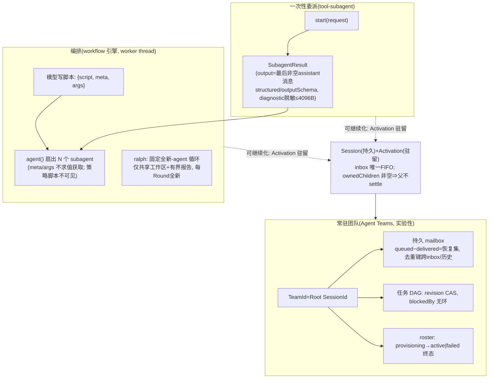

# 笔记 07|子代理与工作流(Subagent / Workflow / Agent Teams)

> 基于 commit `c291e7961a515f6d7af9304e7fd1d257929aef26`。核心材料:`docs/subsystems/subagent.zh.md`(777 行)、`docs/subsystems/agent-team.zh.md`、`docs/subsystems/workflow.zh.md`、`packages/subagent/README.zh.md`(10 包)、`packages/workflow/README.zh.md`(4 包)。术语表见笔记 01 §六。

## 一、机制作用:多智能体协作的 dsh 答案

dsh 把"多智能体"拆成三个递进的层次:

1. **subagent(委派)**:一个 agent 把有界任务交给子 agent,拿回终态结果——最常用的"干完就散"模式;
2. **workflow(编排)**:agent 运行**由模型编写的编排脚本**,把工作扇出到多个 subagent(并行、循环、聚合);
3. **Agent Teams(协作,实验性)**:持久 roster + 任务 DAG + mailbox 的**常驻团队**——成员是可继续的持久会话,不是一次性调用。

与 bash 不同,subagent 是**可选能力**(不属于 agent loop),且是全仓唯一"**同一上下文可共存多个提供方实现、按名称注册**"的 seam(其余 seam 如 bash 只允许一个执行器;`ctx.subagents` 是注册表,遵循 LLM 适配器注册表模式而非单服务模式)——因为"把任务交给谁"天然是多选的:进程内新建、进程内 fork、经 ACP/Codex/Claude Code/DSH SDK 的进程外运行时(`docs/subsystems/subagent.zh.md:5-11`)。

## 二、代码走读

### 2.1 seam 组成:一个 SD、六个 Provider、两个 Consumer

| 角色 | 包 | 说明 |
|---|---|---|
| Service Definition | `subagent/subagent`(`ctx.subagents` + 词汇) | 注册表 + 一次性 run + 可继续子级 + 发现(`packages/subagent/README.zh.md:31-33`) |
| Provider(进程内) | `subagent-spawn-in-process`(全新子级)、`subagent-fork-in-process`(从父级已完成历史派生) | 共享 `subagent-in-process-driver` |
| Provider(进程外) | `subagent-acp`、`subagent-codex`、`subagent-claude-code`、`subagent-dsh-sdk` | 经各自官方协议运行真实的外部 agent |
| Consumer | `tool-subagent`(委派工具)、`tool-subagent-control`(`send_message`/`interrupt_agent`/`list_agents`) | 注册到 `ctx.tools` |

**多提供方 + 能力 flag 的 fail-loud 契约**:提供方以静态描述符公布启动时能力(`SubagentCapabilities`:`agentOptions`/`outputSchema`/`depthLimit`/`toolFilter`/`persona`,与 `SubagentStartRequest` 选项一一对应);服务在委派前检查,能力不匹配直接 `SubagentError('UNSUPPORTED_CAPABILITY')`,**绝不接受后静默降级**(`docs/subsystems/subagent.zh.md:22-37`;`packages/subagent/subagent/src/types.ts:130`)。

### 2.2 一次性 run:SubagentResult 的终态语义

单次 run 的产出是 `SubagentResult`(`docs/subsystems/subagent.zh.md:290-326`):

- `output` = 子级**最后一条非空 assistant 消息**(空内容消息含 usage-only 跳过,与笔记 04 的投影规则同构);没有非空消息时取累计 assistant 文本流;
- `structured` 仅在请求了 `outputSchema` 且成功满足时存在——**请求 schema 不保证拿到**,子级失败可返回 `stopReason: 'error'`;
- `diagnostic` 是提供方作者写的失败说明,**主动排除**工具输入、文件内容、环境值、凭证与原始协议载荷,限 4096 UTF-8 字节——给父级模型看的信息有明确的脱敏边界;
- 非 `completed` 的 `stopReason` ⇒ 消费方必须映射为 `isError` 工具结果,**不得把部分输出当成功**。

### 2.3 可继续子 agent:Session + Activation 两层

这是 subagent 域最核心的设计(`docs/subsystems/subagent.zh.md:124-180`):

```text
persisted Session(持久会话,身份层)
  -> optional live Activation(进程内激活,驻留层)
       -> one retained AgentHandle
       -> Agent inbox as the only turn FIFO(唯一的轮次队列)
       -> zero or more owned child Activations(父子驻留图)
```

- **Activation 不是请求/结果/取消/Task**:它可以执行多个 FIFO 轮次,并在其后代仍在运行期间保持驻留;
- `SubagentRuntime.startContinuable()`(`packages/subagent/subagent/src/index.ts:228`)预留稳定子 id、快照版本化 `subagent/descriptor`、经**私有的 activation-owner 作用域**创建子 Agent、建立所有权、提交初始提示词;**收件箱准入产出消息 id 即 resolve——不等轮次开始、不等消息进日志**;准入前任何失败都回滚(dispose handle + 撤销所有权);
- **消息路由按 Activation 状态自动决定**:目标 `running` → 在最近 step 边界 steer;`waiting` → 唤醒并 steer;无 Activation → **冷恢复**新 Activation 再 steer。调用方不能选择投递模式;
- **权限来自确切在线 sender**:parent→child 要求目标 `SessionHeader.parentSession` 指向 sender;child→parent 要求 sender 的驻留 Activation 指向目标;**sibling、隔代祖先、自寻址、陈旧 Agent 对象、一次性 child 一律拒绝**;接受的消息以 `Agent <sender-id> sent a message:` 前缀落账(`packages/subagent/subagent/src/continuation-messages.ts:68`)——**来源信息记录 sender 但不授予权限**(归因 ≠ 授权);
- **释放条件是自下而上的**:子级"无活跃工作 + Inbox 空 + 其每个子级已 dispose + flush 结算 + handle dispose"才释放;`ownedChildren` 非空则父级无法 settle——**活着的后代把整条祖先链钉在驻留图里**。

### 2.4 workflow:模型写的编排脚本

`workflow` 组(4 包):`ctx.workflowEngine` 是**单服务 seam**(与 bash 同型:一个引擎,worker-thread 实现把每个 run 放进独立 `node:worker_threads`——"把脚本的同步工作移出宿主事件循环,**这只是隔离,不是安全边界**",`packages/workflow/README.zh.md:9`)。启动请求 `WorkflowStartRequest` 的关键契约(`docs/subsystems/workflow.zh.md:23-45`):`meta`/`args` 是纯 JSON,**引擎绝不通过对脚本文本求值来获取它们**(先 schema 校验再执行);`parent` 必填——脚本启动的每个子 agent 都归属该 Agent;引擎级 `subagentProvider` 与 `maxTotalAgents` 只能被专用消费方调低,**脚本无法观察或替换策略**。

两个面向模型的工具分工明确(`packages/workflow/README.zh.md:31-37`):通用 `workflow` 工具(脚本化扇出)与固定的 **`ralph`** 工具——"针对一个不可变目标运行由多个**全新**子 agent 组成的前台序列,每个 Round 只接收上一份有界报告与共享工作区状态;父级对话与先前子 agent 会话**绝不会**复制到新的 Round"(`packages/workflow/tool-ralph/README.zh.md:12`),且模型体验注释明确"仅当直接用户明确要求 Ralph 式迭代时使用,普通长期工作用 goal 工具,有界委派用 subagent/workflow"——三个工具(goal/subagent/ralph)的边界写在模型可见的描述里。

### 2.5 Agent Teams(实验性):roster、mailbox、任务 DAG

`packages/experimental/agent-team`(`docs/subsystems/agent-team.zh.md`):

- **身份**:`TeamId` 就是 Root `SessionId`(品牌化);成员的持久身份是 Session id,`name` 是不可变的模型/UI 标签;`TeamMemberSnapshot` 的 phase 只有 `provisioning → active | failed` 终态,**运行时 running/idle/inactive 状态单独派生、绝不重写记录**;
- **持久 mailbox**:先存完整 queued message,**target 的 pending inbox 条目或用户消息完成持久化后才写独立 acknowledgement event**——"queued 减 delivered"即恢复 mailbox;每条消息尝试 Steer 投递(running→step 边界、idle→新轮次、inactive→冷恢复);`TeamMessageSource`(`kind:'team-message'` + messageId + senderId)是 target 侧**跨 inbox 与历史的去重键**——崩溃恢复后不会重复投递;
- **共享任务 DAG**:每条 task event 存完整快照;`revision` 是 compare-and-s CAS 值;`blockedBy` 边必须指向未删除任务并**维持无环图**;`writeScopes` 是"提示性路径前缀,不是锁"。

## 三、三层协作全景



## 四、设计权衡

1. **注册表 seam vs 单服务 seam**:subagent 需要多提供方共存(进程内两种 + 进程外四种),故 `ctx.subagents` 学 LLM 注册表而非 bash 单服务——**seam 的服务形态跟着"实现会不会共存"走**,这是三角色模式之外的第四种变量(官方 subagent Agent Note)。
2. **能力 flag + 类型收窄两种发现**:一次性路径用静态 flag(启动前检查,不匹配即拒);可继续路径用 `prepareContinuable` **方法存在即能力**、TypeScript 类型收窄作发现——"编译期能表达的就不用运行时配置"。
3. **持久层与驻留层分离**:Session 是身份与恢复的载体,Activation 是进程内的驻留事实;崩溃丢的只是 Activation,冷恢复重建。这与笔记 03 的"配置快照语义"、笔记 04 的"账本唯一真源"一脉相承:**可丢的是运行时化身,不可丢的是账本**。
4. **workflow 的安全观诚实**:worker thread "只是隔离,不是安全边界"写在 README 第一段;`meta`/`args` "绝不求值获取"是注入防线;策略字段脚本不可见——**在一个允许模型写脚本的系统里,边界声明本身就是设计**。
5. **ralph 的激进实验性**:全新 agent 每 Round、仅共享工作区与有界报告——上下文完全不继承,是对"上下文污染"问题的最激进回答;但工具描述同时严格限定使用条件(goal/subagent/ralph 三分),实验性与约束并存。

## 五、与 Deep Agents 对比

| 维度 | dsh | Deep Agents |
|---|---|---|
| 委派形态 | `ctx.subagents` 注册表 + 6 提供方(含 Codex/Claude Code 等异构运行时) | `task` 工具 + SubagentMiddleware(同类运行时) |
| 一次性结果 | `SubagentResult`(output/structured/diagnostic 分离,脱敏边界成文) | 子代理返回摘要给主上下文 |
| 生命周期 | 可继续子级:Session+Activation,FIFO 轮次、驻留图、冷恢复 | 子代理结束即销毁(委派即弃) |
| 消息 | `sendMessage`(相邻限定)+ steer/queue 双模式;归因≠授权 | 无 agent 间消息(单向上行摘要) |
| 编排 | workflow:模型写脚本扇出(worker thread)+ ralph 全新循环 | 六种编排模式(编译在 agent 结构里,非脚本) |
| 团队 | Agent Teams:roster/任务DAG(CAS+无环)/持久 mailbox(去重) | 无对应物 |
| 隔离边界 | 上下文隔离=fork/spawn 选择;进程隔离=进程外提供方 | 上下文隔离=子代理独立上下文 |

最大差异:dsh 的多智能体是**持久对象**(Session 可恢复、Activation 可驻留、mailbox 可去重),deepagents 的是**一次性函数调用**(调用返回,关系消亡)。代价是 dsh 需要一套所有权图与释放协议(`ownedChildren`、child-first dispose、drain 语义);收益是"继续上次工作""给正在跑的子级发消息"这类操作有了地基。另一点值得注意:deepagents 的六种编排模式是**预编译的结构**,dsh 的 workflow 是**模型即席写脚本**——前者的可复现性高,后者的表达上限高。

## 六、读码才知清单(本篇增量)

1. **subagent 是全仓唯一的"多提供方注册表型 seam"**:其余能力 seam(bash、workflow 引擎等)都是"第二实现靠插件配置替换第一,不共存";只有 `ctx.subagents` 与 `ctx.llm` 采用按名注册——因为委派目标天然多选(`docs/subsystems/subagent.zh.md:5-11`)。
2. **`startContinuable` 在收件箱准入即 resolve**(`packages/subagent/subagent/src/index.ts:228`):不等轮次开始、不等落账——"委派成功"的定义是"消息被接收",不是"工作开始";准入前失败则整体回滚。
3. **归因 ≠ 授权**(`continuation-messages.ts:68` + 文档明文):消息前缀记录 sender id,但权限判定只看在线 sender 的谱系事实——防的是"伪造 sender 字段冒充邻居"。
4. **`SubagentResult.diagnostic` 的脱敏边界是接口契约**:提供方必须排除工具输入/文件内容/环境值/凭证/协议载荷,限 4096 字节——父级模型能看到的失败信息是**白名单制**的。
5. **`ralph` 的使用条件写在模型可见的工具描述里**(`tool-ralph/README.zh.md:12,28`):"仅当用户明确要求"——把工具滥用的防线放在 prompt 层而非策略层,与 workflow 的"脚本不可见策略"形成对照(一个信模型,一个防模型)。
6. **Agent Teams 的 mailbox 恢复集 = queued − delivered**(`agent-team.zh.md:33-40`):acknowledgement 是独立事件且只在 target 持久化之后写——崩溃恢复语义精确到"每条消息",去重键跨 inbox 与历史折叠。

---
*校验命令:`grep -n "SubagentCapabilities" packages/subagent/subagent/src/types.ts`(预期 :130);`grep -n "startContinuable" packages/subagent/subagent/src/index.ts`(预期 :228);`grep -n "sent a message" packages/subagent/subagent/src/continuation-messages.ts`(预期 :68)。所有行号引用基于 commit c291e79。*

*下一篇(08)讲上下文管理的另一半:compaction 压缩与 spill 结果外置——长会话如何在不丢账本的前提下装进窗口。*
