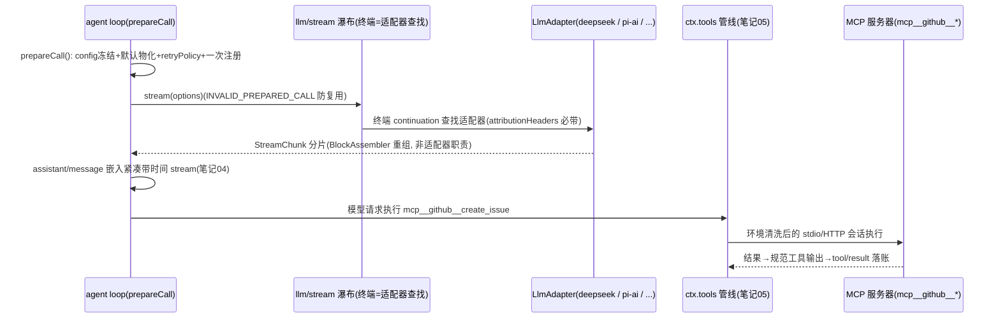

# 笔记 09|模型接缝(llm)与 MCP 工具接入

> 基于 commit `c291e7961a515f6d7af9304e7fd1d257929aef26`。核心材料:`docs/subsystems/llm-streaming.zh.md`(1096 行,重点 §服务与提供方约定 :752 起)、`packages/llm/llm/src/index.ts`、`packages/mcp/README.zh.md` 与 `packages/mcp/mcp-client/README.zh.md`。术语表见笔记 01 §六。

## 一、机制作用:模型可替换的最后一块

笔记 02 埋过一个伏笔:LLM seam 是**官方"不预防性拆包"的范例**——Service Definition 和 Consumer 合并在 `dsh-llm` 一个包里(Consumer 是 agent loop 本身,不存在可替换的"面向模型的 schema 接口"),适配器作为 Service Provider 兄弟包。本篇看两件事:①`ctx.llm` 的适配器注册与一次模型调用的准备协议(`prepareCall`);②外部 MCP 服务器的工具如何变成 dsh 原生工具。

## 二、代码走读

### 2.1 适配器契约:`LlmAdapter`(`packages/llm/llm/src/index.ts:200`)

提供方约定极简:创建 `LlmAdapter` 子类、实现 `stream()`、用 `ctx.llm.registerAdapter(providers, adapter)` 注册(`:387`),`GenerateOptions.provider` 选择路由。`LlmRuntime`(`:333`)是 SD 本体。除 `stream()` 外的钩子都是元数据服务,每个都有明确的"建议性"边界:

- `providerInfo(provider)` → 显示元数据(id 必须等于 provider);
- `providerRetryPolicy()` → 按路由的重试策略,undefined 用默认;
- `listModels()` → **目录仅供参考,不是请求白名单**——适配器可以接受未列出的模型 id,消费方不得把"目录缺失"变成拒绝;
- `resolveModel()` → 确切模型身份 + 可选的上下文容量/默认 maxTokens/推理强度;**字段缺失 = 元数据不可用或保留提供方行为,不 = 无效**;
- `imageRequestPricing()` → 计价由 `ctx.tokenMeter` 单例按测量解析,适配器只回答"本路由的图像定价"。

**归因是强制契约**:每个提供方 HTTP 请求必须带 `attributionHeaders()`(`index.ts:196`;实现见 `src/attribution.ts:64`)——直接 fetch 的 DeepSeek 适配器与走库的 pi-ai 适配器内部不同,但都要证明头部已加上。

### 2.2 `prepareCall`:一次调用的注册绑定协议

模型调用不是"现调现解析",而是**先准备、后分派**两段式(`docs/subsystems/llm-streaming.zh.md:752-780`):

- `PreparedLlmCall` 把**同一次解析**得到的 config(深冻结、适配器默认值已物化)、retryPolicy、上下文元数据、模态、`systemPromptUpdate`、`adapterDefaults` 打包;`stream(options)` 只能按捕获的注册**分派一次**,复用或不匹配报 `INVALID_PREPARED_CALL`;
- 直接调用也有底线:`resolveCallConfig()` 在 `maxTokens` 缺失时填默认、校验并填入推理强度——**直接分派无法绕过任何已配置行为**;
- agent loop 用 `prepareCall()` 让模型解析、请求头持久记录、分派共用同一注册(呼应笔记 04 的 `request/header` 事件与"模型可见即已记录");
- 适配器查找发生在 `llm/stream` 瀑布的**终端 continuation**——监听器可以在查找前短路,或改路由一个可变一次性请求(笔记 02 的 waterfall 语义在模型路由上的应用)。

### 2.3 流词汇:适配器只需"emit 格式正确的分片"

`StreamChunk` 原始协议 + `BlockAssembler` 的分工:块重组(index 关联、block-start/end)是运行时公共设施,**不是每个适配器各自的问题**(`:752` 段末)。`assistant/message` 嵌入的"紧凑带时间 stream"(笔记 04)就是从这里来的:一次 attempt 的原始分片被紧凑化后嵌入消息事件,成为回放与 usage 的持久证据。

### 2.4 MCP:`mcp-client` 单包桥接

`mcp/` 组只有一个包 `mcp-client`:每台外部 MCP 服务器一个配置项,**默认不启用任何服务器**;**只桥接 Tools 能力——MCP resources 与 prompts 不受支持**(`packages/mcp/README.zh.md:12-14`)。三条硬设计决策(`mcp-client/README.zh.md:72-118`):

1. **服务器限定命名**:`mcp__<serverName>__<rawName>`(如 `mcp__github__create_issue`,与 Claude Code/Codex 同形)。**serverName 用本地配置,绝不用远程 `serverInfo.name`**——远程名称不可信、部署间不唯一、升级会变;有损规范化追加 12 位十六进制 SHA-256,不同身份绝不折叠。收益:名字是 `(serverName, rawName)` 的纯函数 ⇒ **会话历史与权限规则跨 HMR/重同步/重启保持有效**。
2. **环境清洗(stdio)**:子进程环境以 `scrubbedParentEnv()` 为基座——**删除匹配 `/KEY|PASSWORD|SECRET|TOKEN/i` 的环境名与所有 `DSH_*` 名**,再合并配置的 `env`(显式覆盖保留);spawn 由 MCP SDK 负责,本包共享清洗定义(`:132-134`)。
3. **注册交换**:发现、命名、注册进 `ctx.tools`、执行、图片投影(`src/tools.ts`);结果映射进规范工具输出契约(笔记 05 的 canonical output)。

配置示例(`mcp-client/README.zh.md:42-52`):`env` 与 header 都支持 `!!js process.env.X` 插值——凭据经 patch 层注入而非落盘。

## 三、从模型请求到 MCP 工具执行

## 四、设计权衡

1. **合并 SD+Consumer 的条件**:`dsh-llm` 不拆包,因为 Consumer 就是 loop 自己、不存在第二个可替换的面向模型接口——官方 seam 笔记的"只有一种可设想的 Provider 和一个 Consumer 时保持一个包"的正面案例;与之对照,`ctx.subagents` 是注册表(笔记 07)、`ctx.shell` 是单服务(笔记 02)——**同一个三角色模式,服务形态随"实现是否共存、Consumer 是谁"而变**。
2. **目录与白名单分离**:`listModels()` 是建议性目录,不是授权清单;模型路由的权威永远在适配器。这避免了"目录滞后阻塞新模型"的经典运维痛点,也把"目录错误"降级为显示问题。
3. **Prepare/dispatch 两段式**:把"解析"从"分派"里分离,换来的三件事——取消语义精确(笔记 04:任一异步阶段取消不提交系统与用户消息)、请求头记账准确、`INVALID_PREPARED_CALL` 防注册过期复用。成本是 loop 必须持有 PreparedCall 这层间接。
4. **MCP 命名纯函数化**:名字 = f(本地配置, 原始工具名),hash 兜底碰撞——把"外部世界的不可信"挡在命名层,使权限规则与历史引用获得时间稳定性。代价是名字丑(`mcp__github__create_issue`);收益是"重启后权限规则仍然指向同一个工具"。

## 五、与 Deep Agents 对比

| 维度 | dsh | Deep Agents |
|---|---|---|
| 模型接入 | `ctx.llm` 适配器注册表(provider 路由 → 兄弟适配器包) | 构造参数传 model(init_chat_model / LangChain ChatModel) |
| 调用协议 | prepareCall 两段式,`INVALID_PREPARED_CALL` 防复用 | LangGraph 节点内直接 invoke |
| 重试 | 适配器自带 providerRetryPolicy + llm-retry 包 | LangGraph 检查点重放间接处理 |
| 流处理 | BlockAssembler 公共重组,嵌入消息事件持久化 | 框架消息流,无嵌入原始分片 |
| MCP | 单包桥接,默认全关,server-qualified 命名,env 清洗 | MCP 接入 + 异步工具加载(启动不阻塞) |
| 凭据 | patch 层 `!!js process.env` 插值 + spawn 环境清洗正则 | 进程环境直接继承 |

有趣的反差:MCP 侧 **deepagents 的异步加载**(启动只加载 tool 定义)解决的是"服务器多、握手慢";**dsh 的默认全关 + 每服务器一个配置项**解决的是"能力默认最小化"。前者优化体验,后者优化安全面——两个生态对"MCP 服务器默认该不该开"给了相反答案。

## 六、读码才知清单(本篇增量)

1. **归因头部是适配器契约的一部分**(`packages/llm/llm/src/index.ts:196-197`):"prove the headers are added in the wire request or library header hook"——每个提供方请求必须可证明地带归因头,这是审计链从模型调用层就开始的证据。
2. **直接调用也无法绕过配置**:`resolveCallConfig()` 在最终适配器边界填 maxTokens 默认、校验推理强度——"绕过 loop 直接用 ctx.llm"不会绕过治理(`docs/subsystems/llm-streaming.zh.md:752` 段)。
3. **MCP 的 serverName 拒绝采用远程 serverInfo.name**(`mcp-client/README.zh.md:106`):一行注释给出三条理由(不可信/不唯一/会变)——命名稳定性的优先级高于名字美观。
4. **环境清洗是正则而非枚举**:`/KEY|PASSWORD|SECRET|TOKEN/i` + 所有 `DSH_*`——按模式删,新出现的"XX_TOKEN"自动覆盖;显式 `env` 配置在清洗之上合并(显式覆盖保留)。
5. **MCP 只桥接 Tools**(`packages/mcp/README.zh.md:14`):resources 与 prompts 明确不支持——不是能力不足,而是把 MCP 严格定位成"工具来源"之一,资源类上下文仍走 dsh 自己的 fs/web/attachment 体系。

---
*校验命令:`grep -n "export abstract class LlmAdapter" packages/llm/llm/src/index.ts`(预期 :200);`grep -n "registerAdapter(providers" packages/llm/llm/src/index.ts`(预期 :387);`grep -n "环境清洗" packages/mcp/mcp-client/README.zh.md`(预期 :132)。所有行号引用基于 commit c291e79。*

*下一篇(10,系列收尾)讲声明式组合与扩展:bundle 栈、skills 渐进式披露、extensions 模型自修改、hooks 线协议——并给出全系列总图。*
