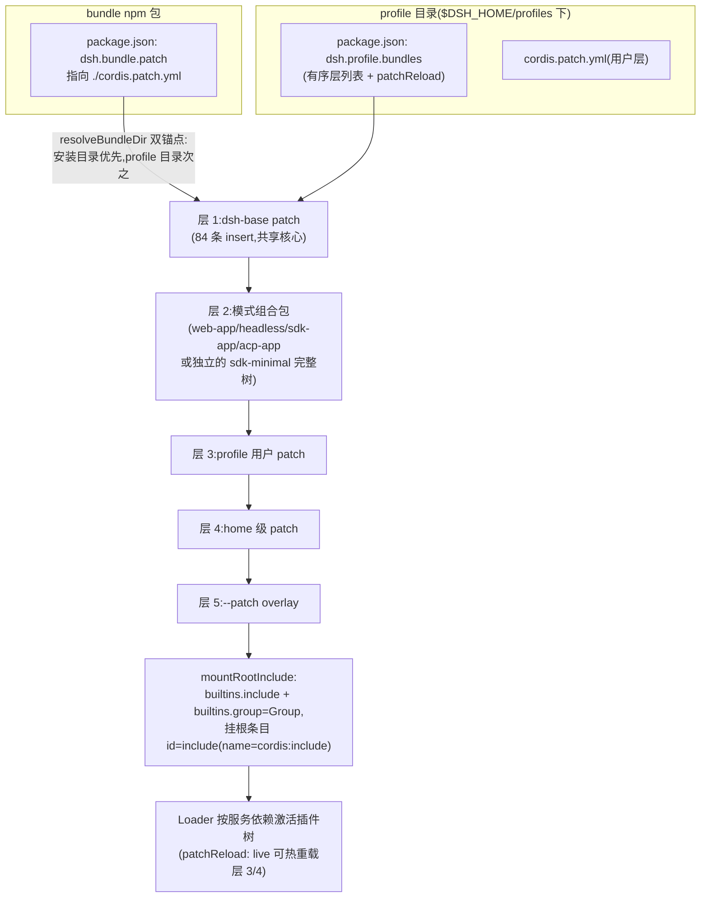

# 笔记 10|声明式组合与扩展(Bundle / Skills / Extensions)

> 基于 commit `c291e7961a515f6d7af9304e7fd1d257929aef26`。核心材料:`packages/bundle/` 6 包 README 与 `cordis.patch.yml`、`packages/skill/` 4 包 README 与源码、`packages/extensions/` 4 包 README 与源码、`packages/hooks/` 3 包 README 与源码、`docs/architecture.zh.md` §Profile 与组合包、设计笔记 `.agents/notes/implemented/architecture/2026-08-05-profile-plugin-bundles.zh.md`。
> 前情:笔记 03 已讲 boot/profile **叠层机制**(patchReload、叠层顺序、preset/scope);本篇讲四条能力域里**声明的内容本身**——bundle 装了什么、skill 怎么被披露、extensions 如何让模型自修改、hooks 借来谁的线协议——并在收尾把笔记 02-10 的机制放回同一棵插件树。术语(SD/Provider/Consumer/fiber/realm/scope)见表见笔记 01 §六。

## 一、机制作用:三种"声明者",四条入口

笔记 02-09 回答的是"一棵插件树如何运转";本篇回答最后一个问题:**用户怎么声明一个智能体**。dsh 把声明权分给了三种角色,各有一条能力域支撑:

| 声明者 | 能力域(包数) | 声明什么 | 持久性 |
|---|---|---|---|
| 部署者/用户 | `bundle/`(6 包) | `dsh --profile` 的补丁层:npm 包在 `package.json` 里声明 `dsh.bundle.patch` 指向一份 YAML,启动器按序叠放组装出具名 profile | 随包安装,写入 `$DSH_HOME/profiles/<name>` |
| 内容作者 | `skill/`(4 包) | 磁盘上的 `SKILL.md`/`<name>.md` 指令包:平时只占目录元数据,用到才加载正文(SKILL.md 渐进式披露) | 随仓库/目录存活,watcher 热发现 |
| **模型自己** | `extensions/`(4 包) | 动态 Cordis 包:"通过模型工具或浏览器面板定义、运行、更新、停止和移除动态 Cordis 包"(`packages/extensions/README.zh.md:12`) | **只存进程内存,重启即消失** |
| (迁移者) | `hooks/`(3 包) | 不是新声明,而是**兼容适配器**:复用为 Claude Code/Codex 写好的 `hooks.json` shell 钩子 | 随外部配置文件 |

四个能力域其实是一条光谱的两端:bundle/skill 是**给"人"用的声明式安装生态**(配置即插件树,笔记 03 的叠层机制就是为它们服务的),extensions 是**给"模型"用的运行时自修改**(把笔记 02 的"注册是可逆副作用"变成模型可调用的动词),hooks 则明确拒绝发明新协议——"当你需要保留现有钩子配置时,选择本组;每项集成只支持其来源工具所记录的 command hook 子集"(`packages/hooks/README.zh.md:12`)。

## 二、代码走读

### 2.1 bundle:一份 package.json 如何变成一棵插件树

bundle 是能力域里唯一"没有 `src` 运行时"的一类——`dsh-base` 的实体就是一份 YAML:

```yaml
# packages/bundle/base/cordis.patch.yml:15(全文 487 行、84 条 insert 行)
- insert:
    - id: timer
      name: '@deepseek-ai/cordis-plugin-timer'
    # ...(llm/session/tools/fs-sandbox/llm-deepseek 等核心行,行内注释即设计依据)
```

声明入口在 `package.json` 的 `dsh` 字段(`packages/bundle/base/package.json:31-35`):

```json
"dsh": {
  "bundle": {
    "patch": "./cordis.patch.yml"
  }
}
```

架构文档一句话定调:"`dsh.profile` 列出一个 profile 的组合包,`dsh.bundle` 指向一个组合包的 patch 文件"(`docs/architecture.zh.md:23`)。装载端在 `packages/boot/app-boot/src/profile.ts`:

- profile 本体:`"A profile is a directory under $DSH_HOME/profiles/<name>"`(`:5`),内含有序 `bundles` 列表与用户层 `cordis.patch.yml`(文件名常量 `PROFILE_PATCH_FILENAME` 在 `:45`);
- 五个内置模板(`:105-125`):`web`/`headless`/`sdk`/`acp` 都是 `[@deepseek-ai/dsh-base, 模式组合包]` 两层栈,唯独 `sdk-minimal` 只列一个组合包(`:122-125`)——它的 patch 文件自己声明 "this insert is the complete Cordis tree"(`packages/bundle/sdk-minimal/cordis.patch.yml:1-2`);
- patchReload 默认 `live`(`:137` `DEFAULT_PROFILE_PATCH_RELOAD = 'live'`),模板按形态覆写为 `startup`(机制已在笔记 03 讲过,不重复);
- **双锚点解析**:`resolveBundleDir`(`:746`)先查 dsh 安装目录、再查 profile 目录——"内置组合包始终来自与运行中 dsh 相同的安装,pnpm 从不管理它们"(同上设计笔记);
- **fail loud**:列出的包若没有 `dsh.bundle` 声明,直接抛错(`:787-790`),JSDoc 原文:"naming a bundle-less package as a layer is a misconfiguration, not 'no patches'"——把"装错包"和"故意不加层"区分开,这是笔记 03"空 patch 文件也启动失败"的同族设计。

**6 个包怎么分**:dsh-base 是共享第一层,一次性插入模型适配器(`dsh-llm`/`dsh-llm-deepseek`)、完整工具集、持久会话、沙箱与审批策略、设置/凭据、遥测等 84 行;模式组合包则薄厚不均:web-app 以 26 行覆盖并追加浏览器表层行(例如用同 id 重述 `system-prompt` 注入 coding persona,`packages/bundle/web-app/cordis.patch.yml:16`),headless 只有 5 行(2 条 persona/tools 覆盖 + 3 条 insert 自己的 startup/runner),sdk-app 与 acp-app 各 4 行;sdk-minimal 则完全脱钩(31 行完整树)。平台差异也活在 patch 里:bash 栈 `disabled: !!js process.platform === 'win32'`、PowerShell 孪生行取反(`packages/bundle/base/cordis.patch.yml:216/222/248/252`)——**每台机器恰好一套 shell 栈,而组装代码零行**。

兑现笔记 03 的一个前向引用:叠好的 patch 列表最终由 `mountRootInclude` 挂载——它在 Loader 上注册两个 builtin(`packages/boot/app-boot/src/index.ts:522` `ctx.loader.builtins.include`、`:540` `builtins.group = Group`),然后以固定 id 挂上根 `cordis:include` 条目(`:549-550` `id: 'include'`)。`cordis:group` 内置之所以在 boot 层注册,注释写明:agent preset 无法按名解析 `@deepseek-ai/cordis-plugin-group`,group 行是"给一个 provider 和它的 consumers 一起发一个 isolate realm"的方式——preset 的 isolate realm(笔记 03 §4.1)靠的就是它。

### 2.2 skill:SKILL.md 的渐进式披露

skill 能力域是一个标准三角色 seam(笔记 02 的模式在"内容"域的重演):

| 角色 | 包 | 证据 |
|---|---|---|
| SD(拥有 `ctx.skills`) | `dsh-skill` | 声明合并 `interface Context { skills: SkillRegistry }`(`packages/skill/skill/src/index.ts:284-285`);`SkillRegistry extends Service`(`:356`) |
| Provider | `dsh-skill-filesystem` / `dsh-skill-badge` | `ctx.skills.registerProvider(...)`(`packages/skill/skill/src/index.ts:390`;`packages/skill/skill-filesystem/src/index.ts:136`) |
| Consumer | `dsh-tool-skill` | 注册 `skill` 工具(`packages/skill/tool-skill/src/index.ts:82`)与两条 `agent/pre-step` 目录监听(`:177`、`:213`) |

**渐进式披露**是整个家族的组织原则,分三段落:

1. **发现只读元数据**。`skill-filesystem` 扫描五个 rank 根目录(rank 常量 `packages/skill/skill-filesystem/src/index.ts:36-40`:project-dsh 100 → project-agents 200 → custom 300 → user-dsh 400 → user-agents 500,随包根按 rank 600 由 `dsh-skill` 的 `BUNDLED_SKILL_RANK = 600`(`packages/skill/skill/src/index.ts:28`)提供),只解析 YAML frontmatter——`name` 必填 kebab-case、`description` 必填,外加 `whenToUse`/`disable-model-invocation`/`user-invocable`(`:1004-1005`)。发现深度刻意只有一层(`<root>/<name>/SKILL.md` 或 `<root>/<name>.md`)。
2. **目录消息常驻**。`tool-skill` 在首个请求前注入一条持久用户角色消息,只含名称与截断描述(默认上限 500 字符,`:27`),渲染进 `<available_skills>` 信封(`:262-264`),并附防双重加载规则:"This catalog contains summaries only; do not infer or follow a skill's instructions until it has been loaded"(`packages/skill/tool-skill/README.zh.md:125`)。目录变更走 digest 比对后的**全量替换消息**(空目录显式停用旧名)。
3. **正文按需加载**。模型以精确名称调 `skill` 工具才拿到 `<skill_content>` 全文;注册表"定义从不缓存——每次加载都向提供方请求当前正文"(`packages/skill/skill/README.zh.md:99`),所以正文编辑不需要任何版本化协议。用户 `/name` 手势走同一渲染函数 `renderSkillContent`(`packages/skill/skill/src/index.ts:170`)——两条加载路径,一种模型可见形态。

调用策略是注册表保留的全部四种组合(`modelInvocable` × `userInvocable`,默认双 true 在 `:449`),`disable-model-invocation` 的 skill 唯一入口就是 `/name` 手势——目录与 `skill` 工具永不暴露它。提供方侧还有两条工程约束值得记:提供方依次查询(慢提供方延迟后者)、失效由提供方驱动(注册表没有 TTL,`invalidate()` 递增 revision 并发 `skills/change` 事件)。

### 2.3 extensions:模型给自己写插件

这是全仓库最"自指"的能力域:**agent 运行时的扩展机制本身被暴露成 agent 的工具**。`tool-cordis` 注册七个模型侧工具(`packages/extensions/tool-cordis/src/index.ts`):三个只读检查 `cordis_inspect_list`(`:45`)/`cordis_inspect_query`(`:64`)/`cordis_inspect_self`(`:100`),四个生命周期动词 `cordis_define`(`:152`)/`cordis_run`(`:244`)/`cordis_stop`(`:333`)/`cordis_undefine`(`:355`)。运行职责在双半 runner:

```typescript
// packages/extensions/cordis-host-runner/src/index.ts:81-83,124,140
interface Context { dynamicCordisRunner: DynamicCordisRunnerService }   // 声明合并
export class DynamicCordisRunnerService extends TypertRemoteService {   // :124
  super(ctx, 'dynamicCordisRunner')                                     // :140 构造即注册
}
```

host 半的代码在 `node:vm` 沙箱求值(`packages/extensions/cordis-host-runner/src/sandbox.ts:14` 导入、`:129` `createSandbox`——"a fresh realm whose globals..."),唯一配置 `vmTimeoutMs` 默认 5000ms(`cordis-host-runner/src/index.ts:128`)且**只约束同步求值**,async 主体可逃出——所以 README 的信任立场写得很直白:"沙箱隔离全局变量,但不是安全边界……对待动态包要像对待 bash 访问一样"(`packages/extensions/cordis-host-runner/README.zh.md:54`)。浏览器半是另一个 Cordis 世界:`cordis-client-runner` 在 client 面声明自己的 `ctx.dynamicCordisRunner`(`packages/extensions/cordis-client-runner/src/client/index.ts:127-129`),`inject = ['loader', 'modules', 'slots', 'remote', 'remote.dynamicCordisRunner']`(`:182`)——同一个服务键,两个进程各有一份实现,经四条 `cordis/*` 转发事件(如 `cordis/request-run`)往返,带浏览器半的包要等人在 `ui-cordis` 面板上批准。

三条"读码才知"级别的约束:**定义以会话为界、以进程为本**(包只对定义它的会话可见,重启即清空,不写任何磁盘文件);**版本不可变**(`currentPackageId`/`nextPackageId` 指针,更新 = 追加新包再切换);**run 先于渲染**(run 成功回执不保证 React 渲染成功,失败经 steering 消息回传)。

### 2.4 hooks:借来别人的线协议

hooks 不发明协议,而是实现别人的:`dsh-hooks-claude-code` 支持七事件(`packages/hooks/hooks-claude-code/src/config.ts:12-18`:`SessionStart`/`UserPromptSubmit`/`PreToolUse`/`PostToolUse`/`Stop`/`SubagentStart`/`SubagentStop`),`dsh-hooks-codex` 五事件(`packages/hooks/hooks-codex/src/config.ts:11` 的 `CODEX_EVENTS`)。事件到扩展点的映射(`packages/hooks/hooks-claude-code/src/index.ts`)就是把笔记 05 的工具管线和 agent 事件域翻译成线协议:

| 线协议事件 | dsh 扩展点(行号) | 分发语义 |
|---|---|---|
| `SessionStart` | `agent/session-start`(`:205`) | emit,脱离运行 |
| `UserPromptSubmit` | `agent/pre-step`(`:218`) | waterfall,可阻塞提示词 |
| `PreToolUse` | `tools/pre-execute`(`:237`) | waterfall,deny/ask |
| `PostToolUse` | `tools/post-execute`(`:246`) | waterfall,阻塞反馈 |
| `Stop` | `agent/turn-stopping`(`:269`) | serial,阻塞经 `agent.steer(...)` 强制再一步(`:274`) |
| `SubagentStart`/`SubagentStop` | `subagent/start`(`:280`)/`subagent/end`(`:290`) | 同进程 child 注入/只观测 |

共享引擎 `dsh-hook-protocol` 的几个硬数字:钩子命令**经 `dsh-shell` 执行器**跑而非自建 spawn(`runner.ts:67` `runHook`,内部 `bash.run` 在 `:87`),默认超时 600 秒(`:20` `DEFAULT_HOOK_TIMEOUT_MS = 600_000`——即 Claude Code 默认值);多钩子结果按 `deny > ask > allow` 最严格合并(`merge.ts:12` `MergedDecision`);每次调用落一对持久事件 `hook/invoked`/`hook/result`(`events.ts:76`、`:95`)。"绝不向循环抛异常"是引擎的收口原则——无效正则是运行时不匹配,执行器拒绝降级为无退出码的 `HookOutput`。

## 三、结构/流程

### 3.1 从一份 package.json 到一棵插件树(bundle 叠层)



> 图注:层 3-5 的叠层顺序与 patchReload 机制属笔记 03 §3;本图补的是层 1-2 的**内容来源**——每个 bundle 层都是一份纯数据 YAML,由 `dsh.bundle` 声明、双锚点解析、按 `dsh.profile.bundles` 顺序叠加。

### 3.2 收尾:全系列机制总图(笔记 02-10 放回一棵插件树)

```mermaid
flowchart TB
    KERNEL["vendor/cordis 微内核:Context/Service/inject/Fiber<br/>(笔记 02)——注册是可逆副作用"]
    KERNEL --> BOOT["boot:mountRootInclude + profile 叠层<br/>(笔记 03)——bundle栈→patch×2→overlay"]
    BOOT --> SESS["ctx.sessions 事件溯源日志<br/>(笔记 04)——append-only,surface 投影"]
    BOOT --> TOOLS["ctx.tools 工具注册表与执行管线<br/>(笔记 05)——pre-execute→execute→post-execute"]
    TOOLS --> GUARD["审批/沙箱/超时守卫(笔记 05)"]
    BOOT --> COMP["compaction 压缩(笔记 08)——替换历史保前缀"]
    BOOT --> BUNDLE["本篇 §2.1 bundle:dsh-base+模式包<br/>——模型适配器/工具/持久化/沙箱在此插入"]
    BOOT --> SKILL["本篇 §2.2 skill:ctx.skills 注册表<br/>——SKILL.md 渐进式披露"]
    BOOT --> EXT["本篇 §2.3 extensions:动态 Cordis 包<br/>——模型可写插件实时挂载/卸载"]
    BOOT --> HOOKS["本篇 §2.4 hooks:线协议桥<br/>——七/五事件映射回扩展点"]
    SKILL -- "目录消息 + skill 工具结果" --> REQ["模型请求(提示词 + 工具 schema)"]
    BUNDLE -- "system-prompt/tools/llm 行" --> REQ
    REQ --> LOOP["agent loop(笔记 02:loop 也是普通插件)"]
    LOOP --> TOOLS
    HOOKS -.->|"waterfall/serial 监听" GUARD
    EXT -.->|"运行中包注册工具/服务" TOOLS
    TOOLS -- "工具调用" --> SESS
    LOOP -- "每轮事件" --> SESS
```

> 图注:实线是数据/装配流,虚线是"回写"路径——extensions 与 hooks 的特别之处正是**它们在运行中改写树的可见面**(注册工具、拦截事件),而不像 bundle 只在启动时成形。笔记 06/07/09 的机制枝(LLM/流式与 subagent 等)以成稿笔记为准,图中从略;`agent loop` 自身是插件(笔记 02 §五),故画在树内而非树顶。

## 四、设计权衡(官方文档出处)

1. **显式有序层列表,否决了依赖扫描。** profile-plugin-bundles 设计笔记的 Alternatives considered 第一条:扫描 `dependencies` 找组合包、其余按字母序的草案会产生"两个真源和一条隐式决胜规则";最终选择显式 `dsh.profile.bundles`——"更小、完全确定"(`.agents/notes/implemented/architecture/2026-08-05-profile-plugin-bundles.zh.md`)。配套地,双锚点解析也否决了 `link:` 条目方案(pnpm 无法版本管理指向安装目录的 `link:`)。
2. **patch 替换整行 config,不合并——用"必须重述"换"最多两个写入者"。** 架构文档:"一条 patch 按 id 定位某个条目并替换其整个 config"(`docs/architecture.zh.md:27`);base README 的推论:"每个 patch 条目会替换目标的整个配置,因此请重述每个想保留的设置",且"按模式取值不同的行不属于这里……让任何单一行最多只属于一个组合包层加用户层"(`packages/bundle/base/README.zh.md:82`)。代价是覆盖啰嗦,收益是任何行的生效来源一眼可判(还有 `--dump-config` 兜底)。
3. **bundle 保持纯数据:否决 manifest 里的启动前 context 模块。** 同一设计笔记:原拟在 bundle manifest 放承载 dist 路径等启动期取值的 context 模块,被否决改用"普通配置行和由应用持有的启动服务"——因此组合始终可完整 dump、manifest 保持纯数据。这与 web-app 用 `!!js` 表达式读 flag 但让取值服务先行(笔记 03)是同一姿态的两面。
4. **模型自修改被刻意做成"临时的"。** extensions 的定义"只存在于进程内存中,并在 DSH 重启时消失"(`packages/extensions/README.zh.md:12`),持久扩展的正道仍是 bundle/patch;沙箱"不是安全边界"、加载工具集"要像授予 bash 工具那样慎重"(`packages/extensions/tool-cordis/README.zh.md:59`)。自修改是给"有用但不应成为仓库插件"的东西准备的一次性出口,不是持久安装渠道。

## 五、与 Deep Agents 对比

| 维度 | dsh | deepagents(已确立事实) |
|---|---|---|
| 形态 | 可运行产品:声明式安装生态(bundle/profile + skill + hooks) | Python 库:中间件即扩展单元,**无 bundle/profile 安装概念** |
| 组合层 | npm 包 + `dsh.bundle.patch`,按 profile 有序叠层,可热重载 | 中间件以参数传入 agent 工厂,组装即代码 |
| 技能 | skill 三角色 seam:注册表 + 多提供方 + 目录/loader 工具,SKILL.md 渐进式披露(发现只读 frontmatter,加载才读正文) | SKILL.md 渐进式披露(progressive disclosure)已支持,Skills vs Memory 有辨析 |
| 模型自修改 | extensions:七个 `cordis_*` 工具让模型定义/运行/停止/移除动态 Cordis 包(内存定义、不可变版本、可卸载) | **无模型自修改插件机制** |
| 外部钩子兼容 | hooks 线协议桥:复用 Claude Code 七事件 / Codex 五事件的 command 钩子,共享引擎 + deny>ask>allow 合并 | 无 hooks 线协议 |
| 本质对比点 | **声明式安装生态**:能力以"可安装的声明"存在,改声明=改运行时 | **中间件参数**:能力以"可组合的代码对象"存在,改能力=改代码 |

**三框架总览**(Claude Code 列为公开资料,且经 dsh README 的显式比较折射;deepagents 列沿用上表):

| 维度 | dsh | deepagents | Claude Code(公开资料) |
|---|---|---|---|
| 声明式安装 | profile/bundle patch 层 + `dsh plugin add` | 无(库,参数即组装) | 插件/市场安装机制 |
| 技能格式 | SKILL.md + frontmatter(`disable-model-invocation` 等键沿用 Claude Code 约定),五级 rank 目录发现 | SKILL.md 渐进式披露已支持 | SKILL.md 原生(格式基线) |
| 钩子 | 兼容适配器:运行 Claude Code/Codex 现有 command 钩子(据 `hooks-claude-code` README,Claude Code 当前 30 项 hook 事件中桥接支持 7 项,基线为其官方 hook 事件参考) | 无 hooks 线协议 | 原生 hooks.json:30 项 hook 事件 |
| 扩展执行者 | 人(bundle/skill)+ 模型(extensions)双层 | 人(代码) | 人(配置/插件) |
| 运行时自修改 | 有,进程内存、重启即清空 | 无 | 无 |

## 六、读码才知清单

1. **内置组合包永远来自安装目录,不来自 profile。** `resolveBundleDir` 的双锚点顺序是契约——先 installAnchor 再 profileDir(`packages/boot/app-boot/src/profile.ts:746-757`),否则被 pnpm 装进 profile 的旧版 `dsh-base` 会静默替换运行时核心。复核:`grep -n "resolveBundleDir" packages/boot/app-boot/src/profile.ts` → `:746`(定义)、`:785`(调用)。
2. **"没有 bundle 声明"是误配置,不是"零补丁"。** `:787-790` 抛 `"declares no dsh.bundle"`。复核:`grep -n "declares no dsh.bundle" packages/boot/app-boot/src/profile.ts` → `:789`。
3. **skill 正文从不缓存,目录 digest 只认元数据。** 注册表"定义从不缓存——每次加载都向提供方请求当前正文"(`packages/skill/skill/README.zh.md:99`);tool-skill 目录按"已发布条目的 digest"比较,仅改正文不触发重发布(`packages/skill/tool-skill/README.zh.md:73`)——所以"编辑 skill 内容"与"改名字/描述"走的是两条完全不同的失效路径。复核:`grep -n "renderSkillContent" packages/skill/skill/src/index.ts` → `:170`。
4. **hook 的 `transcript_path` 永远是空串。** 桥接"出于兼容性保留在 payload 中,但始终为 ''":持久化 seam 不暴露产物路径,且默认 Zstandard 压缩的会话日志钩子脚本读不了(`packages/hooks/hooks-claude-code/README.zh.md:91`)——线协议兼容停在你拿得到的数据上,不为兼容伪造事实。复核:`grep -n "transcript_path" packages/hooks/hooks-claude-code/src/index.ts`。
5. **`cordis:group` builtin 由 boot 注册,而不是让 preset 按名解析包。** `packages/boot/app-boot/src/index.ts:540` `ctx.loader.builtins.group = Group`,注释明说 preset 无法解析 `@deepseek-ai/cordis-plugin-group`——笔记 03 §4.1 的 isolate realm 语法能用在 preset 里,靠的是这条启动胶水。复核:`grep -n "builtins.group = Group" packages/boot/app-boot/src/index.ts` → `:540`。
6. **extensions 的 `inject` 在浏览器半是读出来的,不是播报出来的。** `cordis/request-run` "只携带元数据,绝无代码或服务清单",浏览器半声明的 `inject` 从页面里返回的插件上读取(`packages/extensions/cordis-host-runner/README.zh.md:133`)——host 永远不替浏览器半执行代码,连声明都不代读。

---
*校验命令:`grep -n "declares no dsh.bundle" packages/boot/app-boot/src/profile.ts`(预期 :789);`grep -n "export const PROFILE_TEMPLATES" packages/boot/app-boot/src/profile.ts`(预期 :105);`grep -n "class SkillRegistry extends Service" packages/skill/skill/src/index.ts`(预期 :356)。所有行号引用基于 commit c291e79。*

*(系列收尾:笔记 02-10 合起来是同一句话——dsh 把"一个智能体"完全表达为一棵可声明、可替换、可自修改的插件树,内核里没有一行特权代码。)*
